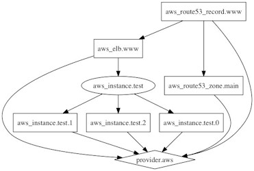
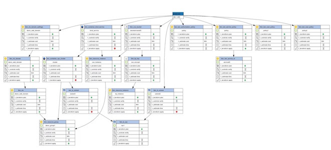

<!-- Estilos globales sin generar slide inicial -->
<style>
.remark-slide-content {
  background-image: url("img/header.png");
  background-repeat: no-repeat;
  background-position: top center;
  background-size: contain;
  padding-top: 60px;
  font-size: 16px; 
  line-height: 1.5;
}

.remark-slide-content::after {
  content: "Pedro Prieto Alarcón / José Luis Gil Gil";
  position: fixed;
  bottom: 10px;
  left: 20px;
  font-size: 12px;
  color: #666;
  white-space: pre;
}

.slide-number {
  position: fixed;
  bottom: 10px;
  right: 20px;
  font-size: 12px;
  color: #666;
}

.remark-code, .remark-inline-code {
  font-size: 14px; 
}

.remark-slide-content h1 { padding-top: 20px; font-size: 36px; }
.remark-slide-content h2 { font-size: 28px; }
.remark-slide-content h3 { font-size: 22px; }
.remark-slide-content h4 { font-size: 18px; }

.remark-slide-content h1 code,
.remark-slide-content h2 code,
.remark-slide-content h3 code,
.remark-slide-content h4 code {
  font-size: inherit;
  background: none;
  padding: 0;
}

img.logo {
position: absolute; top: 105px; left: 10px; height: 50px;
}

div.arbol{
font-family: monospace;
 background-color: #f0f0f0; 
padding: 1em;
 border-radius: 8px; l
ine-height: 1.5
}

.indice {
  font-size: 1.5em;
  line-height: 1.6;
}
</style>


# Terraform

<div class="indice">
🔵 <strong>Instalación y configuración básica de Terraform</strong><br>
⚪ Estructura básica de un proyecto<br>
⚪ Lenguaje HCL<br>
⚪ Terraform CLI<br>
⚪ Variables (Local Values, Input Variables), Outputs<br>
⚪ Providers, Resources, DataSources<br>
⚪ Mapeo y gráfico de dependencias y grafico<br>
⚪ Gestión del estado<br>
⚪ Workspaces<br>
⚪ Aspectos avanzados (I): Modules, Expressions, Functions<br>
⚪ Aspectos avanzados (II): Provisioners<br>
</div>


---


# ¿Qué es Terraform y por qué instalarlo?

Terraform es una herramienta de infraestructura como código (IaC) desarrollada por HashiCorp. Permite a los administradores y desarrolladores definir, aprovisionar y gestionar infraestructura en múltiples proveedores cloud mediante archivos de configuración declarativos.

Terraform se distribuye como un binario independiente, lo que facilita su instalación en diferentes entornos como Windows, Linux o macOS. No requiere dependencias adicionales ni instalación compleja, lo cual lo convierte en una opción muy accesible para la mayoría de usuarios técnicos.

📘[Introducción a Terraform – documentación oficial](https://developer.hashicorp.com/terraform/intro)

📘[Instalación - documentación oficial](https://developer.hashicorp.com/terraform/tutorials/aws-get-started/install-cli)

- Para instalar Terraform es necesario seguir los pasos de la [documentación oficial](https://developer.hashicorp.com/terraform/tutorials/aws-get-started/install-cli).
- Dependiendo del sistema, será necesario actualizar la variable `PATH`.
- Para verificar su instalación se puede ejecutar:
  ```bash
  terraform version
  ```
- Para consultar la ayuda:
  ```bash
  terraform -help
  ```

---
# Configuración de Terraform para trabajar con AWS

Después de instalar Terraform, necesitas configurar las credenciales de AWS. Hay dos formas principales:

**1. Usando `aws configure` (requiere AWS CLI):**

```bash
aws configure
```

Esto guarda tus claves en `~/.aws/credentials` y `~/.aws/config`.

**2. Usando variables de entorno:**

```bash
export AWS_ACCESS_KEY_ID="AKIA..."
export AWS_SECRET_ACCESS_KEY="abc123..."
```

Terraform detecta automáticamente ambas configuraciones si usas el proveedor AWS.

📘[Configuración del proveedor AWS](https://registry.terraform.io/providers/hashicorp/aws/latest/docs#authentication)

---
# Configuración de Terraform para trabajar con Azure

Para configurar Terraform con Azure debes:

**1. Iniciar sesión con Azure CLI:**

```bash
az login
```

**2. Si usas entornos automatizados, crea un Service Principal:**

```bash
az ad sp create-for-rbac --role="Contributor" --scopes="/subscriptions/xxxxx"
```

Luego define estas variables de entorno:

```bash
export ARM_CLIENT_ID="..."
export ARM_CLIENT_SECRET="..."
export ARM_SUBSCRIPTION_ID="..."
export ARM_TENANT_ID="..."
```

Terraform detectará estas variables automáticamente si usas el proveedor AzureRM.

📘[Configuración del proveedor AzureRM](https://registry.terraform.io/providers/hashicorp/azurerm/latest/docs#authentication)


---


# Terraform
<div class="indice">
✅ Instalación y configuración básica de Terraform<br>
🔵 <strong>Estructura básica de un proyecto</strong><br>
⚪ Lenguaje HCL<br>
⚪ Terraform CLI<br>
⚪ Variables (Local Values, Input Variables), Outputs<br>
⚪ Providers, Resources, DataSources<br>
⚪ Mapeo y gráfico de dependencias y grafico<br>
⚪ Gestión del estado<br>
⚪ Workspaces<br>
⚪ Aspectos avanzados (I): Modules, Expressions, Functions<br>
⚪ Aspectos avanzados (II): Provisioners<br>
</div>
---


# ¿Qué es un proyecto en Terraform?

Un proyecto en Terraform representa un conjunto de configuraciones organizadas para aprovisionar una infraestructura. El núcleo de un proyecto consiste en una o varias configuraciones `.tf` que definen recursos, variables, outputs, y proveedores.

Todo lo que se encuentra en una misma carpeta es interpretado por Terraform como un único módulo raíz. Estos archivos `.tf` se procesan en orden lógico, no alfabético ni por nombre de archivo, lo cual permite dividir la configuración en múltiples archivos sin afectar su funcionamiento.

📘[Estructura general de configuración](https://developer.hashicorp.com/terraform/language/files)

Un proyecto típico suele tener esta estructura mínima:

<div class="arbol">
📁 <strong>Proyecto</strong><br>
├── <strong>main.tf</strong> — Recursos principales<br>
├── <strong>variables.tf</strong> — Declaración de variables<br>
├── <strong>outputs.tf</strong> — Outputs que expone el proyecto<br>
└── <strong>terraform.tfvars</strong> — Valores concretos para las variables
</div>

Cada archivo tiene un propósito específico, pero todos se combinan como una sola unidad de ejecución.

📘[Guía de estilo de archivos](https://developer.hashicorp.com/terraform/language/files)

---
# Ejemplo de `main.tf` básico

Un archivo `main.tf` define recursos y el proveedor. Ejemplo para AWS:

```hcl
provider "aws" {
  region = "us-west-2"
}

resource "aws_s3_bucket" "example" {
  bucket = "mi-bucket-ejemplo"
  acl    = "private"
}
```

Este archivo puede contener uno o muchos recursos, o incluso incluir los bloques de variables directamente.

📘[Ejemplo con AWS](https://registry.terraform.io/providers/hashicorp/aws/latest/docs)

---
# Ejemplo equivalente de `main.tf` para Azure

```hcl
provider "azurerm" {
  features {}
}

resource "azurerm_resource_group" "rg" {
  name     = "miRG"
  location = "westeurope"
}
```

El archivo define el proveedor y un recurso de Azure. El archivo `main.tf` es flexible, y puede incluir tantos recursos como se necesiten.

📘[Ejemplo con AzureRM](https://registry.terraform.io/providers/hashicorp/azurerm/latest/docs)

---
# Archivo `variables.tf`: definición de entradas

Las variables se declaran usando bloques `variable`. Ejemplo:

```hcl
variable "region" {
  description = "Región de despliegue"
  type        = string
  default     = "us-east-1"
}

variable "project_name" {
  description = "Nombre del proyecto"
  type        = string
}
```

Estas variables pueden ser utilizadas dentro de `main.tf` con `var.nombre_variable`.

📘[Variables en Terraform](https://developer.hashicorp.com/terraform/language/values/variables)

---
# Archivo `terraform.tfvars`: valores asignados

Puedes usar `terraform.tfvars` para definir los valores concretos que usarán las variables:

```hcl
region       = "us-west-1"
project_name = "demo"
```

Terraform detecta este archivo automáticamente, y lo aplica al ejecutar `plan` o `apply`.

También puedes usar `*.auto.tfvars`, que siguen el mismo propósito pero permiten múltiples archivos.

📘[Asignación de variables](https://developer.hashicorp.com/terraform/language/values/variables#assigning-values-to-root-module-variables)

---
# Archivo `outputs.tf`: resultados exportables

Los outputs exponen información útil al final del `apply`, o para pasar valores entre módulos.

```hcl
output "resource_group_name" {
  value       = azurerm_resource_group.rg.name
  description = "Nombre del resource group creado"
}
```

Pueden marcarse como `sensitive` si contienen datos sensibles que no deben mostrarse.

📘[Outputs](https://developer.hashicorp.com/terraform/language/values/outputs)

---
# Separación de lógica por archivos

Aunque se suelen usar archivos como `main.tf`, `variables.tf`, etc., en realidad no es obligatorio. Terraform procesa todos los archivos `.tf` juntos.

Puedes, por ejemplo, separar tu infraestructura así:

<div class="arbol">
📁 <strong>Proyecto</strong><br>
├── <strong>provider.tf</strong> — Configuración del proveedor<br>
├── <strong>networking.tf</strong> — Recursos de red (VPC, subredes...)<br>
├── <strong>compute.tf</strong> — Recursos de cómputo (instancias...)<br>
└── <strong>storage.tf</strong> — Recursos de almacenamiento
</div>


Esta organización ayuda a mantener limpio el proyecto conforme crece.

📘[Convenciones de estructura](https://developer.hashicorp.com/terraform/language/files#file-ordering)

---
# Organización recomendada por componente

Una recomendación habitual es agrupar por tipo de recurso:

- `networking.tf`: VPC, subnets, gateways
- `compute.tf`: EC2, Azure VMs
- `database.tf`: RDS, Azure SQL
- `security.tf`: IAM, NSG

Esto mejora la claridad y el mantenimiento del proyecto, especialmente en equipos grandes.

📘[Estructura modular y escalable](https://catalog.workshops.aws/terraform101/en-US/2-fundamentals/p01-folder-structure)

---
# Estructura de carpetas para múltiples entornos

Otra estructura habitual es separar por entorno:

<div class="arbol">
📁 <strong>Proyecto</strong><br>
├── <strong>dev/</strong><br>
│   ├── <strong>main.tf</strong> — Recursos del entorno de desarrollo<br>
│   └── <strong>terraform.tfvars</strong> — Variables para desarrollo<br>
├── <strong>prod/</strong><br>
│   ├── <strong>main.tf</strong> — Recursos del entorno de producción<br>
│   └── <strong>terraform.tfvars</strong> — Variables para producción<br>
├── <strong>modules/</strong><br>
│   └── <strong>vpc/</strong> — Módulo reutilizable de red (VPC)
</div>

Cada carpeta contiene una configuración idéntica pero con valores distintos, permitiendo despliegues paralelos por entorno.

📘[Buenas prácticas de estructura por entorno](https://developer.hashicorp.com/terraform/language/modules/sources#local-paths)


---


# Terraform
<div class="indice">
✅ Instalación y configuración básica de Terraform<br>
✅ Estructura básica de un proyecto<br>
🔵 <strong>Lenguaje HCL</strong><br>
⚪ Terraform CLI<br>
⚪ Variables (Local Values, Input Variables), Outputs<br>
⚪ Providers, Resources, DataSources<br>
⚪ Mapeo y gráfico de dependencias y grafico<br>
⚪ Gestión del estado<br>
⚪ Workspaces<br>
⚪ Aspectos avanzados (I): Modules, Expressions, Functions<br>
⚪ Aspectos avanzados (II): Provisioners<br>
</div>
---


# ¿Qué es HCL?

HCL (HashiCorp Configuration Language) es el lenguaje de configuración utilizado por Terraform. Es un lenguaje **declarativo**, estructurado por bloques y diseñado para ser legible por humanos. Aunque tiene una sintaxis específica, también admite interpolaciones y expresiones lógicas.

El código en HCL suele estar organizado por **bloques**, con llaves y pares `clave = valor`. Un ejemplo típico sería un recurso cloud:

```hcl
resource "aws_s3_bucket" "ejemplo" {
  bucket = "mi-bucket"
  acl    = "private"
}
```

📘[Guía de sintaxis de configuración](https://developer.hashicorp.com/terraform/language/syntax/configuration)

---
# Estructura general de un bloque HCL

Los bloques de HCL tienen esta forma:

```
<tipo> "<nombre_proveedor>" "<nombre_local>" {
  argumento1 = valor
  argumento2 = valor
}
```

Por ejemplo:

```hcl
resource "azurerm_resource_group" "main" {
  name     = "rg-ejemplo"
  location = "westeurope"
}
```

Los bloques pueden contener **atributos** (pares clave-valor), **bloques anidados** (como `tags`, `ingress`, etc.) y **metaargumentos** como `depends_on`, `count`, `for_each`.

📘[Bloques y estructura HCL](https://developer.hashicorp.com/terraform/language/syntax/configuration#blocks)

---
# Tipos de datos en HCL

HCL soporta varios tipos de datos básicos:

- **string**: `"texto"`
- **number**: `42`, `3.14`
- **bool**: `true` / `false`
- **list**: `["a", "b", "c"]`
- **map**: `{ key1 = "value1", key2 = "value2" }`
- **tuple**: `[true, 42, "hello"]`
- **object**: `{ name = "Juan", edad = 30 }`

Se pueden declarar tipos explícitamente en variables:

```hcl
variable "regiones" {
  type = list(string)
}
```

📘[Tipos en Terraform](https://developer.hashicorp.com/terraform/language/expressions/types)

---
# Comentarios en HCL

Puedes documentar tu código usando comentarios:

```hcl
# Comentario de una línea

/*
Comentario de
varias líneas
*/
```

Es recomendable comentar bloques complejos o explicar decisiones de infraestructura para otros miembros del equipo o para mantenimiento futuro.

📘[Comentarios en HCL](https://developer.hashicorp.com/terraform/language/syntax/configuration#comments)

---
# Interpolaciones y expresiones

Puedes referenciar otros valores usando la sintaxis `${...}`:

```hcl
resource "aws_instance" "web" {
  tags = {
    Name = "${var.entorno}-web"
  }
}
```

Desde Terraform 0.12, ya no es necesario `${}` en muchos casos. Puedes usar directamente:

```hcl
Name = var.entorno
```

📘[Interpolaciones y expresiones](https://developer.hashicorp.com/terraform/language/expressions/strings)

---
# Operadores en HCL

HCL incluye operadores lógicos y de comparación:

- Comparación: `==`, `!=`, `>`, `<`, `>=`, `<=`
- Booleanos: `&&` (and), `||` (or), `!` (not)
- Concatenación: `"prefix-${var.nombre}"`

Ejemplo:

```hcl
locals {
  es_produccion = var.env == "prod"
}
```

📘[Expresiones condicionales](https://developer.hashicorp.com/terraform/language/expressions/conditionals)

---
# Ejemplo completo en AWS con tipos y expresiones

```hcl
variable "env" {
  type    = string
  default = "dev"
}

resource "aws_s3_bucket" "logs" {
  bucket = "${var.env}-logs"
  acl    = "private"

  tags = {
    Environment = var.env
  }
}
```

Este ejemplo muestra uso de variables, interpolaciones, tipos y etiquetas.

📘[Ejemplo con variables y recursos](https://developer.hashicorp.com/terraform/language/values/variables)

---
# Ejemplo equivalente en Azure

```hcl
variable "env" {
  type    = string
  default = "dev"
}

resource "azurerm_storage_account" "logs" {
  name                     = "${var.env}logsacct"
  resource_group_name      = azurerm_resource_group.rg.name
  location                 = azurerm_resource_group.rg.location
  account_tier             = "Standard"
  account_replication_type = "LRS"

  tags = {
    Environment = var.env
  }
}
```

Mismo concepto: uso de `var.env` para nombre dinámico y etiquetas.

📘[Variables y recursos en Azure](https://registry.terraform.io/providers/hashicorp/azurerm/latest/docs/resources/storage_account)

---
# Buenas prácticas con HCL

- Usa nombres significativos para recursos y variables.
- Documenta tu código con comentarios útiles.
- Separa los archivos por propósito (`main.tf`, `variables.tf`, `outputs.tf`).
- Usa tipos explícitos para evitar errores.
- Valida tu configuración con `terraform validate`.

Estas prácticas ayudan a mantener proyectos legibles, predecibles y colaborativos.

📘[Guía de estilo y validación](https://developer.hashicorp.com/terraform/cli/commands/validate)


---


# Terraform
<div class="indice">
✅ Instalación y configuración básica de Terraform<br>
✅ Estructura básica de un proyecto<br>
✅ Lenguaje HCL<br>
🔵 <strong>Terraform CLI</strong><br>
⚪ Variables (Local Values, Input Variables), Outputs<br>
⚪ Providers, Resources, DataSources<br>
⚪ Mapeo y gráfico de dependencias y grafico<br>
⚪ Gestión del estado<br>
⚪ Workspaces<br>
⚪ Aspectos avanzados (I): Modules, Expressions, Functions<br>
⚪ Aspectos avanzados (II): Provisioners<br>
</div>
---


# Introducción a Terraform CLI

Terraform CLI (Command Line Interface) es la principal herramienta para interactuar con proyectos Terraform. Permite desde la inicialización del entorno, validación y aplicación de cambios hasta el manejo de estado y workspaces.

Los comandos básicos se ejecutan desde la raíz del proyecto donde se ubican los archivos `.tf`. Algunos de los más usados son:

- `terraform init`
- `terraform plan`
- `terraform apply`
- `terraform destroy`
- `terraform validate`
- `terraform fmt`

📘[Comandos de Terraform CLI](https://developer.hashicorp.com/terraform/cli/commands)

---

# Comando `terraform init`

```bash
terraform init
```

Este comando inicializa el directorio de trabajo de Terraform. Realiza:

- Descarga de proveedores especificados (ej. AWS, AzureRM).
- Creación del directorio `.terraform/`.
- Validación de configuración del backend si se usa uno remoto.

Debe ejecutarse siempre al comenzar un proyecto o tras modificar el `provider` o el `backend`.

📘[`init`](https://developer.hashicorp.com/terraform/cli/commands/init)

---

# Comando `terraform plan`

```bash
terraform plan
```

Este comando **simula** los cambios que se aplicarían sin realizarlos. Es muy útil para:

- Ver qué recursos se crearán, destruirán o modificarán.
- Revisar diferencias entre el estado actual y la configuración `.tf`.

Puedes pasar variables:

```bash
terraform plan -var="region=us-east-1"
```

O usar un archivo `.tfvars`:

```bash
terraform plan -var-file="dev.tfvars"
```

📘[`plan`](https://developer.hashicorp.com/terraform/cli/commands/plan)

---

# Comando `terraform apply`

```bash
terraform apply
```

Aplica los cambios necesarios para alcanzar el estado deseado definido en los archivos `.tf`. Se recomienda ejecutar `terraform plan` primero para validar los cambios.

Puedes automatizar la confirmación:

```bash
terraform apply -auto-approve
```

También puedes aplicar un plan guardado:

```bash
terraform apply tfplan
```

📘[`apply`](https://developer.hashicorp.com/terraform/cli/commands/apply)

---

# Comando `terraform destroy`

```bash
terraform destroy
```

Este comando destruye todos los recursos definidos en el proyecto. Es útil para entornos temporales como `dev` o `test`.

Puedes evitar la confirmación interactiva con:

```bash
terraform destroy -auto-approve
```

⚠️ Usa con precaución: borra todos los recursos gestionados por Terraform.

📘[`destroy`](https://developer.hashicorp.com/terraform/cli/commands/destroy)

---

# Comando `terraform validate`

```bash
terraform validate
```

Valida la sintaxis de los archivos `.tf`. No accede a los proveedores ni modifica nada. Útil para detectar errores básicos de estructura y lógica.

Se recomienda usarlo antes de `plan` o como paso en pipelines CI/CD.

📘[`validate`](https://developer.hashicorp.com/terraform/cli/commands/validate)

---

# Comando `terraform fmt`

```bash
terraform fmt
```

Formatea automáticamente el código Terraform siguiendo la convención oficial. Asegura consistencia y mejora la legibilidad del proyecto.

Puedes aplicarlo de forma recursiva:

```bash
terraform fmt -recursive
```

📘[`fmt`](https://developer.hashicorp.com/terraform/cli/commands/fmt)

---

# Comando `terraform show`

```bash
terraform show
```

Muestra el contenido del archivo de estado `.tfstate`. Útil para visualizar qué recursos han sido creados, sus atributos y relaciones actuales.

Puedes exportarlo en formato legible o JSON:

```bash
terraform show -json > estado.json
```

📘[`show`](https://developer.hashicorp.com/terraform/cli/commands/show)

---

# Comando `terraform output`

```bash
terraform output
```

Muestra los outputs definidos tras una ejecución. Puedes acceder a un output específico con:

```bash
terraform output nombre_output
```

También puedes exportarlos en JSON:

```bash
terraform output -json
```

📘[`output`](https://developer.hashicorp.com/terraform/cli/commands/output)

---

# Comando `terraform graph`

```bash
terraform graph
```

Genera un grafo de dependencias entre recursos. Se puede renderizar con Graphviz:

```bash
terraform graph | dot -Tpng > dependencias.png
```

Ideal para visualizar la estructura de tu infraestructura.

📘[`graph`](https://developer.hashicorp.com/terraform/cli/commands/graph)

---

# Comando `terraform console`

```bash
terraform console
```

Abre una consola interactiva para evaluar expresiones Terraform. Útil para pruebas rápidas con variables, funciones o outputs.

Ejemplo:

```hcl
> upper("dev")
"DEV"
```

📘[`console`](https://developer.hashicorp.com/terraform/cli/commands/console)


---


# Terraform
<div class="indice">
✅ Instalación y configuración básica de Terraform<br>
✅ Estructura básica de un proyecto<br>
✅ Lenguaje HCL<br>
✅ Terraform CLI<br>
🔵 <strong>Variables (Local Values, Input Variables), Outputs</strong><br>
⚪ Providers, Resources, DataSources<br>
⚪ Mapeo y gráfico de dependencias y grafico<br>
⚪ Gestión del estado<br>
⚪ Workspaces<br>
⚪ Aspectos avanzados (I): Modules, Expressions, Functions<br>
⚪ Aspectos avanzados (II): Provisioners<br>
</div>
---


# Tipos de variables en Terraform

Terraform permite definir **valores reutilizables** mediante distintos mecanismos:

- **Input variables**: se definen con `variable` y permiten pasar datos externos al módulo.
- **Local values**: permiten definir valores derivados o intermedios con `locals`.
- **Outputs**: exponen información útil hacia fuera del módulo.

Estos mecanismos son fundamentales para reutilizar código, separar la lógica y conectar módulos entre sí.

📘[Visión general de valores en Terraform](https://developer.hashicorp.com/terraform/language/values)

---
# Input variables: definición

Se definen en el archivo `variables.tf` y se referencian como `var.nombre`.

```hcl
variable "region" {
  type        = string
  description = "Región donde desplegar"
  default     = "us-east-1"
}

variable "tags" {
  type = map(string)
}
```

Pueden tener `default`, un `description` y un `type`. También pueden ser requeridas si no hay valor por defecto.

📘[Definición de variables](https://developer.hashicorp.com/terraform/language/values/variables#declaring-an-input-variable)

---
# Input variables: asignación

Puedes asignar valores de tres maneras:

**1. Archivo `.tfvars`:**

```hcl
region = "eu-west-1"
```

**2. Línea de comandos:**

```bash
terraform apply -var="region=eu-west-1"
```

**3. Variables de entorno:**

```bash
export TF_VAR_region="eu-west-1"
```

Terraform aplica esta prioridad: CLI > archivo `.tfvars` > valores por defecto.

📘[Asignar variables](https://developer.hashicorp.com/terraform/language/values/variables#assigning-values-to-root-module-variables)

---
# Uso de variables dentro del código

Una vez declaradas, puedes usarlas así:

```hcl
resource "aws_instance" "web" {
  ami           = var.ami_id
  instance_type = var.tipo
}
```

También puedes construir cadenas con ellas:

```hcl
tags = {
  Name = "${var.entorno}-web"
}
```

O bien directamente (Terraform >= 0.12):

```hcl
Name = var.entorno
```

📘[Uso de variables](https://developer.hashicorp.com/terraform/language/values/variables#using-input-variable-values)

---
# Ejemplo completo con variables – AWS

```hcl
variable "bucket_name" {
  type        = string
  description = "Nombre del bucket"
}

resource "aws_s3_bucket" "ejemplo" {
  bucket = var.bucket_name
  acl    = "private"
}
```

Puedes pasar `bucket_name` desde CLI, `.tfvars` o variable de entorno. Este enfoque evita hardcoding y permite reutilización.

📘[Variables con AWS](https://registry.terraform.io/providers/hashicorp/aws/latest/docs/resources/s3_bucket)

---
# Ejemplo equivalente con variables – Azure

```hcl
variable "rg_name" {
  type        = string
  description = "Nombre del resource group"
}

resource "azurerm_resource_group" "rg" {
  name     = var.rg_name
  location = "westeurope"
}
```

Aquí también usamos `var.rg_name` como referencia al valor de entrada. Compatible con `.tfvars`, CLI o entorno.

📘[Variables con AzureRM](https://registry.terraform.io/providers/hashicorp/azurerm/latest/docs/resources/resource_group)

---
# Local values (`locals`)

Sirven para definir valores derivados o intermedios que no dependen del entorno externo.

```hcl
locals {
  prefijo = "demo"
  nombre_bucket = "${local.prefijo}-bucket"
}
```

Se accede con `local.nombre`. Son útiles para simplificar expresiones repetitivas o construir nombres dinámicos.

📘[Valores locales](https://developer.hashicorp.com/terraform/language/values/locals)

---
# Uso combinado de `locals` y `variables`

```hcl
variable "entorno" {
  type = string
}

locals {
  prefijo = "${var.entorno}-infra"
}

resource "aws_s3_bucket" "logs" {
  bucket = "${local.prefijo}-logs"
}
```

Este patrón se usa para construir recursos a partir de inputs + lógica local.

📘[Composición con locals](https://developer.hashicorp.com/terraform/language/values/locals)

---
# Outputs en Terraform

Outputs permiten exponer información tras el `apply`:

```hcl
output "bucket_name" {
  value       = aws_s3_bucket.logs.bucket
  description = "Nombre del bucket creado"
}
```

Se muestran al final de `terraform apply`, y también se pueden exportar en JSON.

Los outputs pueden marcarse como `sensitive` para ocultarlos.

📘[Outputs](https://developer.hashicorp.com/terraform/language/values/outputs)

---
# Ejemplo de output en Azure

```hcl
output "resource_group_id" {
  value       = azurerm_resource_group.rg.id
  description = "ID del resource group creado"
}
```

El output puede ser usado por otros módulos o herramientas externas para referencias cruzadas.

📘[Outputs en Azure](https://registry.terraform.io/providers/hashicorp/azurerm/latest/docs/resources/resource_group)


---


# Terraform
<div class="indice">
✅ Instalación y configuración básica de Terraform<br>
✅ Estructura básica de un proyecto<br>
✅ Lenguaje HCL<br>
✅ Terraform CLI<br>
✅ Variables (Local Values, Input Variables), Outputs<br>
🔵 <strong>Providers, Resources, DataSources</strong><br>
⚪ Mapeo y gráfico de dependencias y grafico<br>
⚪ Gestión del estado<br>
⚪ Workspaces<br>
⚪ Aspectos avanzados (I): Modules, Expressions, Functions<br>
⚪ Aspectos avanzados (II): Provisioners<br>
</div>
---


# ¿Qué es un provider en Terraform?

Un **provider** es un plugin que permite a Terraform interactuar con APIs de servicios como AWS, Azure, GCP, Kubernetes, etc. Define el conjunto de recursos y data sources disponibles para ese servicio.

Para usar un provider, se debe declarar explícitamente:

```hcl
provider "aws" {
  region = "us-east-1"
}
```

Terraform descarga el provider necesario durante `terraform init`.

📘[Proveedores](https://developer.hashicorp.com/terraform/language/providers)

---
# Declaración de provider en Azure

```hcl
provider "azurerm" {
  features {}
}
```

Al igual que en AWS, Terraform descargará el proveedor y autenticará usando `az login` o variables de entorno. El bloque `features {}` es obligatorio, aunque esté vacío.

📘[Provider AzureRM](https://registry.terraform.io/providers/hashicorp/azurerm/latest/docs)

---
# ¿Qué es un recurso (resource)?

Un **recurso** en Terraform representa un objeto gestionado en la infraestructura, como una instancia EC2, un grupo de recursos, una VNet o un bucket S3.

Los recursos se declaran con:

```hcl
resource "<proveedor>_<tipo>" "<nombre_local>" {
  # Configuración
}
```

Ejemplo básico con AWS:

```hcl
resource "aws_s3_bucket" "logs" {
  bucket = "mi-bucket-logs"
  acl    = "private"
}
```

📘[Recursos en Terraform](https://developer.hashicorp.com/terraform/language/resources/syntax)

---
# Ejemplo de recurso en Azure

```hcl
resource "azurerm_resource_group" "rg" {
  name     = "demo-rg"
  location = "westeurope"
}
```

El tipo de recurso es `azurerm_resource_group`, y el nombre local es `rg`. Puedes usar ese nombre como referencia en otros recursos.

📘[Resource Group en AzureRM](https://registry.terraform.io/providers/hashicorp/azurerm/latest/docs/resources/resource_group)

---
# Estructura de un bloque `resource`

Un bloque `resource` contiene:

- **Argumentos obligatorios**: definidos por el proveedor (ej. `bucket`, `name`, `location`).
- **Atributos opcionales**: como etiquetas (`tags`) o parámetros adicionales.
- **Bloques anidados**: para configuraciones específicas (ej. `versioning`, `ingress`, `timeouts`).
- **Meta-argumentos**: como `depends_on`, `count`, `for_each`.

📘[Sintaxis de recursos](https://developer.hashicorp.com/terraform/language/resources/syntax)

---
# Uso de referencias entre recursos

Puedes usar los atributos de un recurso como entrada de otro:

```hcl
resource "aws_vpc" "main" {
  cidr_block = "10.0.0.0/16"
}

resource "aws_subnet" "subnet" {
  vpc_id     = aws_vpc.main.id
  cidr_block = "10.0.1.0/24"
}
```

Terraform infiere las dependencias automáticamente gracias a estas referencias.

📘[Referencias entre recursos](https://developer.hashicorp.com/terraform/language/expressions/references)

---
# Referencias entre recursos en Azure

```hcl
resource "azurerm_virtual_network" "vnet" {
  name                = "vnet-ejemplo"
  address_space       = ["10.0.0.0/16"]
  location            = "westeurope"
  resource_group_name = azurerm_resource_group.rg.name
}
```

Aquí el recurso depende del `azurerm_resource_group.rg`, del cual obtiene el nombre y ubicación.

📘[VNet en Azure](https://registry.terraform.io/providers/hashicorp/azurerm/latest/docs/resources/virtual_network)

---
# ¿Qué es un data source?

Un **data source** permite obtener información existente fuera del control directo de Terraform, como:

- Una imagen de máquina existente (AMI en AWS, imagen de VM en Azure).
- Un grupo de recursos ya creado.
- Una red virtual externa.

Esto se hace con bloques `data`.

📘[Data sources](https://developer.hashicorp.com/terraform/language/data-sources)

---
# Ejemplo de data source – AWS

```hcl
data "aws_ami" "ubuntu" {
  most_recent = true

  filter {
    name   = "name"
    values = ["ubuntu/images/hvm-ssd/ubuntu-20.04-amd64-*"]
  }

  owners = ["099720109477"]
}
```

Este bloque obtiene la última AMI de Ubuntu publicada por Canonical. Luego puedes usar `data.aws_ami.ubuntu.id` en otros recursos.

📘[AMI data source](https://registry.terraform.io/providers/hashicorp/aws/latest/docs/data-sources/ami)

---
# Ejemplo de data source – Azure

```hcl
data "azurerm_subscription" "current" {}

output "subscription_id" {
  value = data.azurerm_subscription.current.subscription_id
}
```

Este data source obtiene la ID de la suscripción activa, útil para outputs, control de permisos o logs.

📘[Data source Azure Subscription](https://registry.terraform.io/providers/hashicorp/azurerm/latest/docs/data-sources/subscription)

---
# Buenas prácticas con providers, resources y data sources

- Acuérdate de declarar los `provider` en un solo lugar.
- Utiliza `data` cuando necesites leer recursos externos sin crearlos.
- Es siempre mejor usar referencias (`resource.x.y`) en lugar de duplicar valores.
- Documenta tus `resource` con comentarios detallados de su utilidad.
- No abuses de `count` y `for_each` sin necesidad: pueden generar estructuras difíciles de leer.

📘[Documentación general](https://developer.hashicorp.com/terraform/language/resources)

---
# Ejemplo combinado de resource y data source

```hcl
data "aws_ami" "ubuntu" {
  most_recent = true
  owners      = ["099720109477"]

  filter {
    name   = "name"
    values = ["ubuntu/images/hvm-ssd/ubuntu-20.04-amd64-*"]
  }
}

resource "aws_instance" "web" {
  ami           = data.aws_ami.ubuntu.id
  instance_type = "t2.micro"

  tags = {
    Name = "web-instance"
  }
}
```

El `data` obtiene la AMI más reciente y el `resource` la utiliza para crear una instancia EC2. Este patrón es muy común para desplegar máquinas con imágenes estándar.

📘[Uso conjunto de data y resource](https://registry.terraform.io/providers/hashicorp/aws/latest/docs/data-sources/ami)


---


# Terraform
<div class="indice">
✅ Instalación y configuración básica de Terraform<br>
✅ Estructura básica de un proyecto<br>
✅ Lenguaje HCL<br>
✅ Terraform CLI<br>
✅ Variables (Local Values, Input Variables), Outputs<br>
✅ Providers, Resources, DataSources<br>
🔵 <strong>Mapeo y gráfico de dependencias y grafico</strong><br>
⚪ Gestión del estado<br>
⚪ Workspaces<br>
⚪ Aspectos avanzados (I): Modules, Expressions, Functions<br>
⚪ Aspectos avanzados (II): Provisioners<br>
</div>
---


# ¿Qué es el mapeo de dependencias en Terraform?

Terraform construye un grafo interno de dependencias entre recursos. Esto le permite calcular el orden correcto de creación, modificación o destrucción de recursos, **sin necesidad de instrucciones explícitas**.

Las dependencias se infieren automáticamente cuando un recurso hace referencia a otro, por ejemplo:

```hcl
resource "aws_subnet" "sub" {
  vpc_id = aws_vpc.main.id
}
```

En este ejemplo, Terraform sabe que `aws_vpc.main` debe crearse antes que `aws_subnet.sub`.

📘[Dependencias automáticas](https://developer.hashicorp.com/terraform/language/resources/behavior#resource-dependencies)

---
# Ejemplo de dependencia implícita en Azure

```hcl
resource "azurerm_resource_group" "rg" {
  name     = "infra"
  location = "westeurope"
}

resource "azurerm_virtual_network" "vnet" {
  name                = "vnet1"
  address_space       = ["10.0.0.0/16"]
  location            = azurerm_resource_group.rg.location
  resource_group_name = azurerm_resource_group.rg.name
}
```

El VNet depende del `resource_group` porque lo referencia. Terraform lo detecta automáticamente y respeta el orden.

📘[Relaciones implícitas](https://developer.hashicorp.com/terraform/language/resources/behavior#resource-dependencies)

---
# Uso de `depends_on` para dependencias explícitas

En algunos casos, Terraform no puede detectar una dependencia automática. Para esos casos se puede usar `depends_on`:

```hcl
resource "aws_instance" "web" {
  ami           = "ami-123456"
  instance_type = "t2.micro"
  depends_on    = [aws_security_group.web_sg]
}
```

Esto obliga a Terraform a esperar hasta que se cree `web_sg` antes de lanzar la instancia, aunque no haya una referencia directa.

📘[`depends_on`](https://developer.hashicorp.com/terraform/language/meta-arguments/depends_on)

---
# `depends_on` en Azure

```hcl
resource "azurerm_network_interface" "nic" {
  name                = "nic1"
  location            = azurerm_resource_group.rg.location
  resource_group_name = azurerm_resource_group.rg.name
  depends_on          = [azurerm_virtual_network.vnet]
}
```

Aquí se fuerza explícitamente la dependencia entre el `nic` y la VNet. Aunque ya haya una inferencia implícita, `depends_on` asegura el orden de forma explícita.

📘[Meta-argumentos en Azure](https://developer.hashicorp.com/terraform/language/meta-arguments/depends_on)

---
# Visualización del grafo de recursos

Terraform puede generar un grafo visual de las relaciones entre recursos. Para ello se usa:

```bash
terraform graph | dot -Tpng > grafo.png
```

Esto requiere tener instalado **Graphviz** (`dot`). El archivo `grafo.png` mostrará un diagrama con las dependencias que Terraform ha calculado.



📘[`terraform graph`](https://developer.hashicorp.com/terraform/cli/commands/graph)

---
# Interpretación del grafo generado

El grafo contiene nodos y aristas:

- Cada nodo representa un recurso, módulo o proveedor.
- Las flechas indican dependencia (`A → B` significa que B depende de A).
- Los recursos creados por módulos aparecen con un prefijo como `module.<nombre>`.

Este grafo es útil para **entender la lógica de ejecución** de Terraform, especialmente en proyectos grandes.

📘[Ejemplo de grafo](https://developer.hashicorp.com/terraform/cli/commands/graph)

---
# Herramientas adicionales para graficar dependencias

Existen herramientas de terceros como **Blast Radius** que visualizan el grafo de Terraform en forma interactiva.

```bash
blast-radius -p main.tf
```

Permite explorar los recursos, dependencias y relaciones desde un navegador web. Es especialmente útil para comprender módulos complejos y estructuras grandes.




📘 [Blast Radius GitHub](https://github.com/28mm/blast-radius)


---


# Terraform
<div class="indice">
✅ Instalación y configuración básica de Terraform<br>
✅ Estructura básica de un proyecto<br>
✅ Lenguaje HCL<br>
✅ Terraform CLI<br>
✅ Variables (Local Values, Input Variables), Outputs<br>
✅ Providers, Resources, DataSources<br>
✅ Mapeo y gráfico de dependencias y grafico<br>
🔵 <strong>Gestión del estado</strong><br>
⚪ Workspaces<br>
⚪ Aspectos avanzados (I): Modules, Expressions, Functions<br>
⚪ Aspectos avanzados (II): Provisioners<br>
</div>
---


# ¿Qué es el Terraform State?

Terraform mantiene un archivo de estado (`terraform.tfstate`) que **representa el estado actual de la infraestructura** gestionada. Este archivo es esencial para:

- Rastrear los recursos creados y sus propiedades
- Comparar configuraciones durante `plan`
- Conectar recursos entre módulos

Sin el estado, Terraform no puede determinar qué cambiar.

📘[Gestión del estado](https://developer.hashicorp.com/terraform/language/state)

---
# Estructura del archivo `terraform.tfstate`

El archivo `terraform.tfstate` está en formato JSON y contiene:

- Lista de recursos creados
- Atributos actuales de cada recurso
- Identificadores reales (IDs en AWS o Azure)
- Dependencias entre recursos

Este archivo se actualiza con cada `apply` y debe mantenerse sincronizado con la infraestructura real.

📘[Formato de estado](https://developer.hashicorp.com/terraform/language/state/spec)

---
# Ubicación del archivo de estado

Por defecto, `terraform.tfstate` se guarda localmente en el mismo directorio del proyecto. Sin embargo, esto **no es recomendable para entornos compartidos**.

Ejemplo:

```
.
├── main.tf
├── terraform.tfstate
```

Para equipos o pipelines CI/CD, se recomienda **almacenamiento remoto**.

📘[Estado local vs remoto](https://developer.hashicorp.com/terraform/language/state/backends)

---
# Almacenamiento remoto del estado

Terraform permite almacenar el estado en backends remotos como:

- AWS S3 (+ DynamoDB para bloqueo)
- Azure Blob Storage
- GCS (Google Cloud)
- Consul
- Terraform Cloud

Esto mejora la **colaboración, versionado y seguridad** del estado.

📘[Backends remotos](https://developer.hashicorp.com/terraform/language/settings/backends/configuration)

---
# Ejemplo: backend remoto en AWS (S3 + DynamoDB)

```hcl
terraform {
  backend "s3" {
    bucket         = "mi-bucket-terraform"
    key            = "infraestructuras/estado.tfstate"
    region         = "us-east-1"
    dynamodb_table = "terraform-locks"
    encrypt        = true
  }
}
```

Este backend almacena el estado en S3 y usa DynamoDB para evitar conflictos simultáneos.

📘[Backend S3](https://developer.hashicorp.com/terraform/language/settings/backends/s3)

---
# Ejemplo equivalente en Azure (Blob Storage)

```hcl
terraform {
  backend "azurerm" {
    resource_group_name   = "tfstate-rg"
    storage_account_name  = "tfstateaccount"
    container_name        = "tfstate"
    key                   = "infra/estado.tfstate"
  }
}
```

Este backend usa un Blob Storage para almacenar el estado de forma centralizada y segura.

📘[Backend AzureRM](https://developer.hashicorp.com/terraform/language/settings/backends/azurerm)

---
# Inicialización del backend remoto

Tras configurar un backend, se debe ejecutar:

```bash
terraform init
```

Terraform detecta la configuración del backend y:

- Solicita migrar el estado local (si existía)
- Crea el contenedor remoto si no existe
- Sincroniza el archivo `.tfstate` remoto

Este paso es necesario tras cualquier cambio en la configuración del backend.

📘[`terraform init` con backends](https://developer.hashicorp.com/terraform/cli/commands/init)

---
# Bloqueo del estado

Cuando se usa un backend como S3 + DynamoDB o Terraform Cloud, se habilita **lockeo automático del estado**.

Esto previene que múltiples usuarios modifiquen el estado al mismo tiempo, evitando corrupciones.

⚠️ En backends locales no hay bloqueo.

📘[Bloqueo de estado](https://developer.hashicorp.com/terraform/language/state/locking)

---
# Comandos útiles para gestionar el estado

- `terraform state list`: muestra todos los recursos conocidos
- `terraform state show <recurso>`: detalles de un recurso
- `terraform state mv`: mueve recursos entre módulos
- `terraform state rm`: elimina un recurso del estado (sin destruirlo)

Estos comandos permiten mantener y depurar manualmente el archivo de estado.

📘[Gestión manual del estado](https://developer.hashicorp.com/terraform/cli/commands/state)

---
# Sensibilidad y seguridad del estado

El archivo `terraform.tfstate` puede contener **valores sensibles** como contraseñas, tokens o secretos. Por eso se recomienda:

- Usar almacenamiento remoto cifrado (S3 con KMS, Blob Storage con TLS)
- No subir el `.tfstate` al control de versiones
- Marcar outputs como `sensitive = true` para ocultarlos
- Utilizar servicios concretos del provider (como Secrets Manager en AWS), aunque eso reduce la portabilidad

📘[Protección del estado](https://developer.hashicorp.com/terraform/language/state/sensitive-data)


---


# Terraform
<div class="indice">
✅ Instalación y configuración básica de Terraform<br>
✅ Estructura básica de un proyecto<br>
✅ Lenguaje HCL<br>
✅ Terraform CLI<br>
✅ Variables (Local Values, Input Variables), Outputs<br>
✅ Providers, Resources, DataSources<br>
✅ Mapeo y gráfico de dependencias y grafico<br>
✅ Gestión del estado<br>
🔵 <strong>Workspaces</strong><br>
⚪ Aspectos avanzados (I): Modules, Expressions, Functions<br>
⚪ Aspectos avanzados (II): Provisioners<br>
</div>
---


# ¿Qué es un Workspace en Terraform?

Un **workspace** es un entorno lógico de ejecución que permite mantener **varios estados separados** usando la misma configuración de Terraform.

Esto permite, por ejemplo, usar la misma infraestructura base (`.tf`) pero con estados distintos para `dev`, `staging` o `prod`, sin necesidad de duplicar archivos.

📘[Workspaces](https://developer.hashicorp.com/terraform/language/state/workspaces)

Cada workspace tiene su propio archivo `terraform.tfstate`. La configuración `.tf` es la misma, pero los valores y recursos aplicados se gestionan de forma independiente.

Terraform crea por defecto un workspace llamado `default`.

Para crear y cambiar workspaces se usan comandos CLI.

📘[Workspaces y estado](https://developer.hashicorp.com/terraform/language/state/workspaces#how-terraform-uses-workspaces)

---
# Comandos básicos de Workspaces

- Crear un nuevo workspace:

```bash
terraform workspace new staging
```

- Listar workspaces existentes:

```bash
terraform workspace list
```

- Cambiar al workspace deseado:

```bash
terraform workspace select staging
```

- Ver el workspace activo:

```bash
terraform workspace show
```

📘[Comandos CLI relacionados](https://developer.hashicorp.com/terraform/cli/commands/workspace)

---
# Ejemplo de uso de workspaces para entornos

Supón que tienes una infraestructura definida en `main.tf`. Puedes gestionar tres entornos (`dev`, `qa`, `prod`) así:

```bash
terraform workspace new dev
terraform apply  # Aplica recursos al entorno dev

terraform workspace new prod
terraform apply  # Aplica recursos al entorno prod
```

Cada entorno mantiene su propio `terraform.tfstate` y sus propios recursos, aunque compartan el mismo código.

📘[Ejemplo multientorno](https://developer.hashicorp.com/terraform/language/state/workspaces)

---
# Integración de workspace en la configuración

Puedes usar el nombre del workspace dentro del código:

```hcl
resource "aws_s3_bucket" "logs" {
  bucket = "logs-${terraform.workspace}"
  acl    = "private"
}
```

Esto permite crear recursos separados por entorno sin necesidad de múltiples archivos.

📘[Uso de `terraform.workspace`](https://developer.hashicorp.com/terraform/language/state/workspaces#accessing-the-current-workspace)

---
# Ejemplo equivalente en Azure

```hcl
resource "azurerm_storage_account" "logs" {
  name                     = "log${terraform.workspace}"
  resource_group_name      = azurerm_resource_group.rg.name
  location                 = azurerm_resource_group.rg.location
  account_tier             = "Standard"
  account_replication_type = "LRS"
}
```

Se crea un storage account distinto por entorno (`dev`, `staging`, `prod`), gracias a `terraform.workspace`.

📘[Uso de workspace con AzureRM](https://registry.terraform.io/providers/hashicorp/azurerm/latest/docs/resources/storage_account)

---
# Consideraciones al usar workspaces

- ✅ Útiles para entornos con configuraciones idénticas y recursos aislados.  
- ⚠️ No sustituyen a módulos ni estructuras separadas si hay lógica muy diferente entre entornos.  
- ⚠️ Algunos backends (como S3) almacenan el estado de cada workspace en una clave distinta.
  Por ejemplo, S3 usa:
  ```
  s3://bucket/key/default/terraform.tfstate
  s3://bucket/key/prod/terraform.tfstate
  ```

📘[Limitaciones y patrones](https://developer.hashicorp.com/terraform/language/state/workspaces#when-to-use-multiple-workspaces)

---


# Terraform
<div class="indice">
✅ Instalación y configuración básica de Terraform<br>
✅ Estructura básica de un proyecto<br>
✅ Lenguaje HCL<br>
✅ Terraform CLI<br>
✅ Variables (Local Values, Input Variables), Outputs<br>
✅ Providers, Resources, DataSources<br>
✅ Mapeo y gráfico de dependencias y grafico<br>
✅ Gestión del estado<br>
✅ Workspaces<br>
🔵 <strong>Aspectos avanzados (I): Modules, Expressions, Functions</strong><br>
⚪ Aspectos avanzados (II): Provisioners<br>
</div>
---


# Módulos reutilizables

Un **módulo** en Terraform es una agrupación de recursos y lógica reutilizable. Cualquier carpeta con archivos `.tf` puede considerarse un módulo.

Ventajas:

- **Reutilización**: mismo módulo se puede usar con diferentes inputs.
- **Organización**: cada módulo encapsula lógica específica (redes, compute, seguridad).
- **Escalabilidad**: facilita la expansión y mantenimiento de grandes infraestructuras.
- **Colaboración**: equipos diferentes pueden trabajar sobre módulos distintos.

Puedes llamar a un módulo desde un proyecto principal usando el bloque `module`.

Los módulos pueden ser locales o remotos (Terraform Registry, Git, HTTP, etc.).

📘[Conceptos de módulos](https://developer.hashicorp.com/terraform/language/modules/develop)

📘[Diseño de módulos](https://developer.hashicorp.com/terraform/language/modules/sources)

---

# Estructura interna de un módulo

Un módulo bien estructurado debe incluir:

- `main.tf`: lógica principal (recursos)
- `variables.tf`: definición de variables de entrada
- `outputs.tf`: valores exportados

Esto mejora la claridad y permite la reutilización en distintos entornos.

Ejemplo de estructura:

<div class="arbol">
📁 <strong>modulo-red</strong><br>
├── <strong>main.tf</strong><br>
├── <strong>variables.tf</strong><br>
└── <strong>outputs.tf</strong>
</div>

📘[Organización de módulos](https://developer.hashicorp.com/terraform/language/modules/develop)

---
# Ejemplo completo de módulo en AWS

`modulos/s3_bucket/main.tf`:

```hcl
resource "aws_s3_bucket" "bucket" {
  bucket = var.bucket_name
  acl    = var.acl
}
```

`modulos/s3_bucket/variables.tf`:

```hcl
variable "bucket_name" { type = string }
variable "acl"         { type = string }
```

Uso en proyecto:

```hcl
module "logs" {
  source      = "./modulos/s3_bucket"
  bucket_name = "logs-dev"
  acl         = "private"
}
```

📘[Ejemplo de uso local de módulo](https://developer.hashicorp.com/terraform/language/modules/sources)

---
# Ejemplo equivalente del módulo en Azure I

`modulos/storage_account/main.tf`:

```hcl
resource "azurerm_storage_account" "logs" {
  name                     = var.name
  resource_group_name      = var.rg
  location                 = var.location
  account_tier             = "Standard"
  account_replication_type = "LRS"
}
```

`modulos/storage_account/variables.tf`:

```hcl
variable "name"     { type = string }
variable "rg"       { type = string }
variable "location" { type = string }
```

---

# Ejemplo equivalente del módulo en Azure II

Uso:

```hcl
module "logs" {
  source   = "./modulos/storage_account"
  name     = "logsstorage"
  rg       = "rg-ejemplo"
  location = "westeurope"
}
```

📘[Módulos con Azure](https://registry.terraform.io/providers/hashicorp/azurerm/latest/docs/resources/storage_account)

---
# Módulos anidados y reutilización

Terraform permite anidar módulos: un módulo puede usar otros módulos dentro.

```hcl
module "red" {
  source       = "./modulos/red"
  cidr_block   = "10.0.0.0/16"
}

module "servidores" {
  source       = "./modulos/servidores"
  red_id       = module.red.id
}
```

Esto facilita la composición modular de entornos completos.

📘[Módulos dentro de módulos](https://developer.hashicorp.com/terraform/language/modules/develop#calling-modules-from-other-modules)


---

# ¿Qué son las expresiones en Terraform?

Las **expresiones** permiten construir valores a partir de otros, como referencias, operadores o llamadas a funciones. Son fundamentales para tener una estructura ágil y que se pueda reutilizar.

Ejemplos:

```hcl
var.region                  # Referencia
"${var.nombre}-bucket"     # Interpolación
var.entorno == "prod"      # Expresión booleana
length(var.lista) > 2      # Composición
```

Se utilizan dentro de recursos, variables, locals y outputs.

📘[Expresiones en Terraform](https://developer.hashicorp.com/terraform/language/expressions)

---
# Tipos de expresiones

Terraform soporta varios tipos de expresiones:

- **Lógicas**: `&&`, `||`, `!`
- **Condicionales**: `condition ? true_val : false_val`
- **Interpolación de cadenas**
- **Operaciones matemáticas**: `+`, `-`, `*`, `/`
- **Expresiones de colección**: `for`, `for_each`, `count`

Estas permiten crear configuraciones dinámicas, iterar listas y definir comportamientos condicionales.

📘[Tipos de expresiones](https://developer.hashicorp.com/terraform/language/expressions/conditionals)

---
# Expresiones condicionales

Permiten seleccionar valores según una condición:

```hcl
variable "es_produccion" {
  type = bool
}

resource "aws_instance" "web" {
  instance_type = var.es_produccion ? "t3.large" : "t3.micro"
}
```

Útil para cambiar comportamiento según entorno.

📘[Condicionales](https://developer.hashicorp.com/terraform/language/expressions/conditionals)


---
# Expresiones `for` y `for_each`

La expresión `for` permite transformar listas o mapas:

```hcl
[for nombre in var.usuarios : upper(nombre)]
```

`for_each` se usa en recursos:

```hcl
resource "aws_s3_bucket" "usuarios" {
  for_each = toset(var.nombres)

  bucket = "${each.key}-bucket"
}
```

Permiten crear múltiples recursos dinámicamente según una colección.

📘[for](https://developer.hashicorp.com/terraform/language/expressions/for)

---

# Ejemplo `for_each` en Azure

```hcl
resource "azurerm_resource_group" "grupos" {
  for_each = toset(["dev", "qa", "prod"])

  name     = "rg-${each.key}"
  location = "westeurope"
}
```

Se crean 3 grupos de recursos con nombres y comportamiento dinámico.

📘[for_each con AzureRM](https://developer.hashicorp.com/terraform/language/meta-arguments/for_each)


---
# Uso avanzado de `for` en objetos

Se pueden crear mapas dinámicos con `for`:

```hcl
locals {
  tags = {
    for nombre in var.etiquetas :
    nombre => upper(nombre)
  }
}
```

O listas con condiciones:

```hcl
[for v in var.lista : v if v != ""]
```

Permite lógica avanzada y limpieza de datos.

📘[Expresiones for](https://developer.hashicorp.com/terraform/language/expressions/for)


---
# Funciones en Terraform

Terraform incluye una librería extensa de **funciones** integradas:

- **Cadena**: `join`, `replace`, `upper`
- **Números**: `min`, `max`, `abs`
- **Colecciones**: `length`, `contains`, `merge`
- **Date/time**: `timestamp`
- **Codificación**: `base64encode`, `jsonencode`

Ejemplo:

```hcl
local {
  prefijo = upper(var.entorno)
}
```

📘[Funciones integradas](https://developer.hashicorp.com/terraform/language/functions)


---
# Funciones con colecciones: ejemplo práctico

```hcl
locals {
  servidores = ["app1", "app2", "app3"]
  etiquetas  = [for nombre in local.servidores : "srv-${upper(nombre)}"]
}
```

Resultado:

```hcl
["srv-APP1", "srv-APP2", "srv-APP3"]
```

Estas transformaciones son comunes para nombrar recursos o aplicar reglas.

📘[Colecciones y funciones](https://developer.hashicorp.com/terraform/language/functions)

---
# Uso de funciones con condiciones

```hcl
locals {
  zona = var.entorno == "prod" ? "eu-west-1a" : "eu-west-1b"
}
```

Permite lógica adaptativa en base al entorno. Ideal para valores predeterminados o despliegues condicionales.

📘[Funciones y condiciones](https://developer.hashicorp.com/terraform/language/expressions/conditionals)


---
# Composición de funciones y expresiones

Puedes combinar funciones con expresiones para construir lógica compleja:

```hcl
output "prefijo_final" {
  value = upper(replace(var.nombre, " ", "-"))
}
```

Este ejemplo:

1. Reemplaza espacios en `nombre` por guiones
2. Convierte el resultado a mayúsculas

La composición permite mantener configuraciones limpias y potentes.

📘[Ejemplos de funciones](https://developer.hashicorp.com/terraform/language/functions/replace)

---
# Buenas prácticas con expresiones y funciones

- ✅ Utiliza siempre `locals` para encapsular expresiones complejas
- ✅ Es mejor usar funciones integradas antes que lógica en scripts externos
- ✅ Usa `for_each` sobre `count` cuando trabajes con mapas
- ✅ Documenta las expresiones complejas con comentarios representativos de su utilidad 
- ✅ Evita anidamientos excesivos: dificultan legibilidad y compresión del proyecto

📘[Recomendaciones avanzadas](https://developer.hashicorp.com/terraform/language/expressions)

---


# Terraform
<div class="indice">
✅ Instalación y configuración básica de Terraform<br>
✅ Estructura básica de un proyecto<br>
✅ Lenguaje HCL<br>
✅ Terraform CLI<br>
✅ Variables (Local Values, Input Variables), Outputs<br>
✅ Providers, Resources, DataSources<br>
✅ Mapeo y gráfico de dependencias y grafico<br>
✅ Gestión del estado<br>
✅ Workspaces<br>
✅ Aspectos avanzados (I): Modules, Expressions, Functions<br>
🔵 <strong>Aspectos avanzados (II): Provisioners</strong><br>
</div>
---


# ¿Qué es un provisioner en Terraform?

Los **provisioners** ejecutan scripts o comandos dentro o contra una máquina creada por Terraform.

Se usan para:

- Instalar software
- Configurar servicios
- Realizar tareas posteriores al despliegue

⚠️ Deben usarse solo cuando no hay alternativa nativa en el proveedor.

📘[Provisioners](https://developer.hashicorp.com/terraform/language/resources/provisioners)

---
# Tipos de provisioners

Terraform soporta los siguientes provisioners:

- `local-exec`: ejecuta comandos localmente
- `remote-exec`: ejecuta comandos en la máquina provisionada
- `file`: copia archivos desde la máquina local a la remota

Cada uno tiene una sintaxis y uso específico según el caso.

📘[Tipos de provisioners](https://developer.hashicorp.com/terraform/language/resources/provisioners/syntax)

---
# Ejemplo de `local-exec`

```hcl
resource "null_resource" "local" {
  provisioner "local-exec" {
    command = "echo ${var.mensaje} > salida.txt"
  }
}
```

Este comando se ejecuta **en la máquina local** donde se lanza Terraform.

Útil para generar archivos, lanzar scripts o registrar logs.

📘[`local-exec`](https://developer.hashicorp.com/terraform/language/resources/provisioners/local-exec)

---
# Ejemplo de `remote-exec`

```hcl
resource "aws_instance" "ejemplo" {
  ami           = var.ami
  instance_type = "t2.micro"

  provisioner "remote-exec" {
    inline = [
      "sudo apt update",
      "sudo apt install -y nginx"
    ]
  }

  connection {
    type     = "ssh"
    user     = "ubuntu"
    private_key = file("~/.ssh/id_rsa")
    host     = self.public_ip
  }
}
```

Este script se ejecuta **dentro de la instancia AWS**.

📘[`remote-exec`](https://developer.hashicorp.com/terraform/language/resources/provisioners/remote-exec)

---
# Ejemplo equivalente de `remote-exec` en Azure (I)

```hcl
resource "azurerm_linux_virtual_machine" "ejemplo" {
  name                  = "vm-ejemplo"
  resource_group_name   = azurerm_resource_group.rg.name
  location              = azurerm_resource_group.rg.location
  size                  = "Standard_B1s"
  admin_username        = "azureuser"
  network_interface_ids = [azurerm_network_interface.nic.id]
  disable_password_authentication = true
  admin_ssh_key {
    username   = "azureuser"
    public_key = file("~/.ssh/id_rsa.pub")
  }

```

---
# Ejemplo equivalente de `remote-exec` en Azure (II)

```hcl
  provisioner "remote-exec" {
    inline = ["sudo apt update", "sudo apt install -y nginx"]
  }

  connection {
    type        = "ssh"
    user        = "azureuser"
    private_key = file("~/.ssh/id_rsa")
    host        = self.public_ip_address
  }
}
```

📘[remote-exec con Azure](https://registry.terraform.io/providers/hashicorp/azurerm/latest/docs/resources/linux_virtual_machine)

---
# Provisioner `file`

```hcl
resource "aws_instance" "ejemplo" {
  ami           = var.ami
  instance_type = "t2.micro"

  provisioner "file" {
    source      = "app.conf"
    destination = "/etc/app.conf"
  }

  connection {
    type     = "ssh"
    user     = "ubuntu"
    private_key = file("~/.ssh/id_rsa")
    host     = self.public_ip
  }
}
```

Permite copiar archivos desde local hacia la máquina remota.

📘[Provisioner file](https://developer.hashicorp.com/terraform/language/resources/provisioners/file)

---
# Provisioners y dependencias implícitas

Terraform crea automáticamente dependencias entre recursos y provisioners.

Si el `remote-exec` falla, el recurso puede marcarse como fallido.

Puedes controlar la ejecución con `when = create | destroy`.

```hcl
provisioner "remote-exec" {
  when = destroy
  inline = ["echo 'Destruyendo VM'"]
}
```

📘[Ejecutar al destruir](https://developer.hashicorp.com/terraform/language/resources/provisioners/syntax#destroy-time-provisioners)

---
# Buenas prácticas con provisioners

- ✅ Hay que usar `remote-exec` solo si no hay alternativa declarativa
- ✅ Es mejor utilizar `user_data`, `cloud-init` o extensiones nativas de proveedor
- ✅ Ojo, hay qye controlar errores y dependencias explícitamente
- ❌ No abuses: al final reduce portabilidad y reproducibilidad del plan

📘[Recomendaciones de uso](https://developer.hashicorp.com/terraform/language/resources/provisioners#provisioner-behavior)


<div class="slide-number"></div>
