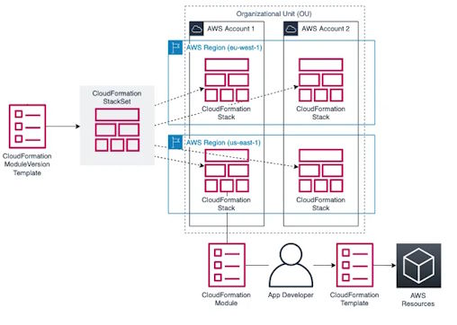
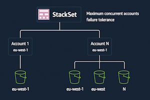
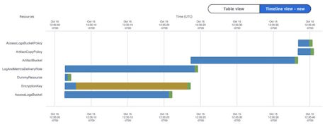

<!-- Estilos globales sin generar slide inicial -->
<style>

    body { margin: 0;
  font-family: 'Roboto', sans-serif; !important

	}
    .remark-container {
      background-color: #F788AF; !important
    }

.remark-code, .remark-inline-code {
  font-family: 'JetBrains Mono', monospace; !important
}

  
.grupo-postincidente {
  display: flex;
  align-items: flex-start;
  margin-top: 1em;
}

.etiqueta-vertical {
  writing-mode: vertical-rl;
  transform: rotate(180deg);
  font-weight: bold;
  font-size: 1em;
  color: #007acc;
  margin-right: 1em;
  text-align: center;
  padding: 0.5em 0;
  border-left: 4px solid #007acc;
}

ul.resaltado {
  background: #f0f8ff;
  border-radius: 6px;
  list-style-type: disc;
  margin: 0;
  margin-right: 2em;
}
ul.resaltado li {
  margin-bottom: 0.5em;
  margin-right: 2em;
}
ul li::marker {
  color: #C05B12;
}

ul {
  list-style-type: square;
}

img.full-height {
  max-height: 45vh;
  height: auto;
  width: auto;
  display: block;
  margin: 0 auto;
}

img.full-width {
  max-width: 100%;
  height: auto;
  display: block;
  margin: 0 auto;
}

.remark-slide-content {
  background-image: url("img/header.png");
  background-repeat: no-repeat;
  background-position: top center;
  background-size: contain;
  padding-top: 60px;
  font-size: 20px; 
  line-height: 1.5;
}

.remark-slide-content::after {
  content: "Pedro Prieto Alarcón / José Luis Gil Gil";
  position: fixed;
  bottom: 10px;
  left: 20px;
  font-size: 22px;
  color: #777;
  white-space: pre;
}

.slide-number {
  position: fixed;
  bottom: 10px;
  right: 20px;
  font-size: 12px;
  color: #666;
}

.remark-code, .remark-inline-code {
  font-size: 14px; 
}

.remark-slide-content h1 { padding-top: 20px; font-size: 36px; }
.remark-slide-content h2 { font-size: 28px; }
.remark-slide-content h3 { font-size: 22px; }
.remark-slide-content h4 { font-size: 18px; }

.remark-slide-content h1 code,
.remark-slide-content h2 code,
.remark-slide-content h3 code,
.remark-slide-content h4 code {
  font-size: inherit;
  background: none;
  padding: 0;
}

img.logo {
position: absolute; top: 105px; left: 10px; height: 50px;
}

div.arbol{
font-family: monospace;
 background-color: #f0f0f0; 
padding: 1em;
 border-radius: 8px; l
ine-height: 1.5
}

.indice {
  font-size: 1.5em;
  line-height: 1.6;
}
</style>


# CloudFormation: IaC nativo en AWS

**AWS CloudFormation** es el servicio nativo para IaC de AWS. Permite definir un conjunto de recursos de AWS mediante un archivo de plantilla (YAML o JSON) y desplegarla de manera **orquestada**. Vistas anteriormente las características fundamentales, ventajas e inconvenientes respecto de otras opciones en IaC, vamos a pasar a tratar todas las características y funcionamiento.

CloudFormation se encarga de crear, actualizar y eliminar los recursos en el orden correcto, manejando automáticamente las **dependencias** entre ellos. 

Al implementar una plantilla, CloudFormation crea una **pila** o *stack* que agrupa todos los recursos. 

El servicio **administra el proceso completo**: desde la creación inicial hasta las actualizaciones, aplicando cambios incrementalmente y haciendo cambios si ocurre algún error.

Como vimos, también tiene detección de cambios en la infraestructura fuera del IaC, lo que se denomina **drift detection**, así como **change sets** para previsualizar cambios a implementar en los despliegues y realiza *rollback automático* si falla.

---


# CloudFormation: IaC nativo en AWS

<div class="indice">
🔵 <strong>Templates en CloudFormation</strong>  <br>
⚪ Stacks en CloudFormation  <br>
⚪ Despliegue y gestión de infraestructura  <br>
⚪ Galería de ejemplos de CloudFormation  <br>
</div>

---

## Templates en CloudFormation 
Comenzamos con las **plantillas de CloudFormation**, el corazón de la Infraestructura como Código en AWS. Una [*plantilla*](https://docs.aws.amazon.com/es_es/AWSCloudFormation/latest/UserGuide/cloudformation-overview.html) es un documento (en JSON o YAML) que describe un conjunto de recursos de AWS y sus configuraciones. Al desplegar una plantilla, CloudFormation crea una **pila** (*stack*) con todos los recursos especificados.  

Las plantillas suelen incluir al inicio una versión de formato (*AWSTemplateFormatVersion*) y una **Descripción** opcional que explica para qué se va usar, componentes... 

```yaml
AWSTemplateFormatVersion: "2010-09-09"
Description: "Plantilla mínima de ejemplo"
...
```  

A partir de ahí, se estructura en secciones, cada una con un fin específico. La sección **Resources** es la única **obligatoria** y constituye el núcleo: en ella definimos los recursos de la pila (ej. instancias EC2, buckets S3), con un identificador lógico, un tipo y sus propiedades.

El resto de secciones le da flexibilidad, capacidades de orquestación, integración con otros elementos, etc.

---

## Anatomía de una plantilla de CloudFormation (además de *Resources*)
- **Parameters** – Define entradas dinámicas para la plantilla, permitiendo personalizar valores al crear la pila (ej. tipo de instancia, tamaños) bien de otras plantillas o de la interfaz de usuario.  

- **Outputs** – Especifica valores de salida de la pila (IDs, URLs, etc.) para mostrarlos tras el despliegue o exportarlos a otras pilas.  

- **Mappings** – Tablas estáticas de datos (clave-valor) para usar configuraciones según condiciones, usando por ejemplo función `Fn::FindInMap`.  

- **Conditions** – Condicionales lógicos que controlan la creación de recursos o valores según parámetros (p. ej., desplegar cierto recurso solo si *Entorno* == "Producción").  

- **Transform** – Aplicar macros o transformaciones al template (por ejemplo, incluir plantillas fragmentadas o usar **AWS::Serverless** para SAM).  

- **Metadata** – Con información descriptiva o instrucciones para herramientas) o sección **Rules** (reglas de validación de parámetros) se usan poco.
📘 [Anatomía de una plantilla de CloudFormation](https://docs.aws.amazon.com/es_es/AWSCloudFormation/latest/UserGuide/template-anatomy.html)

---

## Ejemplo – Estructura mínima de una plantilla 
A continuación se muestra una plantilla mínima en **YAML** con sus secciones principales. Incluimos la versión de formato, una descripción, definimos un recurso (un bucket S3) en **Resources**, y un output que devuelve el nombre lógico del bucket:  

```yaml
AWSTemplateFormatVersion: "2010-09-09"
Description: "Plantilla mínima de ejemplo"
Resources:
  MiS3Bucket:
    Type: AWS::S3::Bucket
Outputs:
  NombreDelBucket:
    Value: !Ref MiS3Bucket
```  

En este ejemplo, la plantilla crearía un solo bucket S3. Vemos cómo la estructura es declarativa: primero la información global (versión, descripción), luego los recursos, y por último las salidas. Esta plantilla podría desplegarse tal cual para crear el bucket y dar como salida la referencia del recurso creado

---

## Parámetros (**Parameters**) 
La sección [**Parameters**](https://docs.aws.amazon.com/es_es/AWSCloudFormation/latest/UserGuide/parameters-section-structure.html) permite **personalizar** una plantilla pasándole valores en tiempo de despliegue. En otras palabras, podemos definir *parámetros* (tipo, descripción, valores por defecto, etc.) que el usuario rellenará al crear o actualizar la pila. Gracias a los parámetros, una sola plantilla puede ser **flexible y reutilizable**, adaptándose a distintos entornos sin modificar el código. 

Los parámetros se referencian dentro de la plantilla para asignar valores a recursos y salidas. Por ejemplo, se pueden usar con la función intrínseca `Ref` u otras funciones para inyectar el valor proporcionado en propiedades de recursos. 

Además, es posible especificar validaciones básicas: tipo de dato (String, Number, Lista, etc.), valores permitidos, longitud máxima, patrón regex, etc., para garantizar que el usuario introduzca datos válidos. 

En definitiva, **Parameters** actúa como la interfaz de nuestra plantilla, exponiendo opciones configurables (tamaños de instancia, nombres, cantidades) de forma controlada, lo que mejora la **reutilización** y **modularidad** de las plantillas.  
---

## Ejemplo – Definición y uso de parámetros 
Imaginemos que queremos que nuestra plantilla permita elegir el tipo de instancia EC2. Definimos un parámetro y luego lo usamos en un recurso:  

```yaml
Parameters:
  InstanceTypeParam:
    Description: "Tipo de instancia EC2"
    Type: String
    Default: t3.small

Resources:
  MiInstanciaEC2:
    Type: AWS::EC2::Instance
    Properties:
      ImageId: ami-0123456789abcdef0
      InstanceType: !Ref InstanceTypeParam
      KeyName: testkey
```  

Aquí **InstanceTypeParam** es un parámetro de tipo *String* con valor por defecto “t3.small”. En la sección Resources, el recurso **MiInstanciaEC2** usa `!Ref InstanceTypeParam` para asignar el tipo de instancia según el valor que proporcione el usuario (o el default): así se pueden lanzar distintos tamaños de instancia variando sólo el parámetro. 
---

## Recursos (**Resources**) 
La sección **Resources** es el núcleo de la plantilla: aquí declaramos cada **recurso AWS** que queremos crear. Cada recurso tiene un **ID lógico** (nombre interno en la plantilla), un **Type** que corresponde a un tipo de recurso de AWS (por ejemplo `AWS::EC2::Instance` para una instancia EC2, `AWS::S3::Bucket` para un bucket S3, etc.) y un bloque de **Properties** donde especificamos la configuración de ese recurso. 

CloudFormation soporta cientos de tipos de recursos de prácticamente todos los servicios AWS (EC2, S3, RDS, IAM, Lambda, ECS, etc.). Al crear la pila, CloudFormation traducirá cada definición en recursos reales en AWS. El orden de creado suele ser un problema, por lo que cloudFormation determina automáticamente las **dependencias** entre recursos: si un recurso hace referencia a otro, esperará a que el referido se cree primero. También podemos forzar dependencias manualmente (veremos **DependsOn** más adelante). 

En resumen, **cada entrada en Resources equivale a un recurso en la infraestructura**. Es como la lista de “ingredientes” que CloudFormation usará para construir el stack. Una plantilla puede tener desde uno hasta cientos de recursos, todos definidos declarativamente en esta sección.  
---

## Ejemplo – Definición de un recurso AWS 
A continuación, un ejemplo simple de un recurso EC2 definido en la sección **Resources**:  

```yaml
Resources:
  MiServidorWeb:
    Type: AWS::EC2::Instance
    Properties:
      ImageId: ami-0abcdef1234567890
      InstanceType: t3.micro
      Tags:
        - Key: Name
          Value: "ServidorWeb"
```  

Aquí el recurso lógico **MiServidorWeb** de tipo `AWS::EC2::Instance` representa una instancia EC2. En **Properties** establecemos la AMI (`ImageId`), el tipo de instancia (`InstanceType`) y una etiqueta (Tag) con nombre “ServidorWeb”. CloudFormation se encargará de lanzar esta instancia con esos parámetros. 

Podemos agregar tantas propiedades como permita el tipo de recurso (grupo de seguridad, user data, etc.). Si este recurso dependiera de otro (por ejemplo, un VPC o subred), con solo referenciarlos CloudFormation asegura el orden correcto de creación.  
---

## Pseudoparámetros 
Los [**pseudoparámetros**](https://docs.aws.amazon.com/es_es/AWSCloudFormation/latest/UserGuide/pseudo-parameter-reference.html) son parámetros predefinidos por CloudFormation que **no necesitan ser declarados** en la plantilla. Están siempre disponibles y proporcionan información del entorno de despliegue o de la propia pila. Se usan igual que un parámetro normal con `Ref` u otras funciones. 

Ejemplos de pseudoparámetros útiles (hay más):  
- **AWS::Region** – La región AWS donde se está desplegando la pila.  
- **AWS::AccountId** – El ID de cuenta AWS en la que se crea la pila.  
- **AWS::StackName** – El nombre de la pila actual.  
- **AWS::NoValue** – Indica a CloudFormation que *ignore* o elimine una propiedad (usado en condiciones).  

Estos valores ayudan a hacer plantillas más **genéricas**. Por ejemplo, usando *AWS::Region* no hace falta codificar una región específica en la plantilla, sino que toma automáticamente la región actual de despliegue. Lo mismo con *AccountId*, útil para construir ARN dinámicamente, etc. 

En resumen, son variables de entorno proporcionadas por CloudFormation para usar dentro de cualquier plantilla.  

---

## Ejemplo – Uso de pseudoparámetros 
Supongamos que queremos obtener la región AWS en la que estamos desplegando la infraestructura y exponerla como output. Podemos hacerlo sin pedir ningún parámetro al usuario, utilizando el pseudoparámetro **AWS::Region**:  

```yaml
Outputs:
  RegionDeLaPila:
    Value: !Ref "AWS::Region"
```  

En este ejemplo, definimos una salida **RegionDeLaPila** cuyo valor es `!Ref AWS::Region`. CloudFormation sustituirá eso por la región actual (p. ej. “eu-west-1”) cuando creemos la pila. El usuario no pasó nada como parámetro, la plantilla automáticamente capturó el dato del entorno de despliegue. 

Del mismo modo podríamos usar *AWS::AccountId* para, por ejemplo, construir el nombre de un bucket único por cuenta, o *AWS::StackName* para incluir el nombre de la pila en alguna configuración. 

Los pseudoparámetros proporcionan contexto del entorno muy útil dentro de las plantillas sin esfuerzo adicional.  
---

## Funciones intrínsecas 
CloudFormation ofrece una serie de [**funciones intrínsecas**](https://docs.aws.amazon.com/es_es/AWSCloudFormation/latest/UserGuide/intrinsic-function-reference.html) (built-in) para calcular valores dinámicamente dentro de la plantilla. Estas funciones nos permiten, por ejemplo, referenciar recursos y parámetros, hacer cálculos simples, concatenar strings, condicionar la creación de recursos, todo ello durante el *runtime*. Se usan con la sintaxis `Fn::<Nombre>` (en YAML existen abreviaturas con `!`). Algunas de las más comunes son:  

- **Ref** / **Fn::GetAtt** – Provienen de otras partes de la plantilla: `Ref` es el valor de un parámetro o el ID lógico de un recurso, `Fn::GetAtt` obtiene un **atributo** de un recurso (p. ej. URL de bucket S3, ARN de Lambda...)  
- **Fn::Join** / **Fn::Sub** – Manipulan cadenas de texto. `Fn::Join` concatena una lista de subcadenas con un separador dado, mientras que `Fn::Sub` permite insertar valores (parámetros, atributos, pseudoparámetros) dentro de una cadena usando placeholders `${}` de forma muy cómoda.  
- **Funciones condicionales** – Como **Fn::If**, **Fn::Equals**, **Fn::And**, **Fn::Or**, **Fn::Not**. Sirven para introducir lógica condicional en la plantilla, por ejemplo crear o no un recurso dependiendo de un valor, o asignar distintos valores a propiedades según una condición booleana.  
- **Fn::FindInMap** – Busca un valor dentro de las **Mappings** según claves dadas (ej. dado un mapping de AMIs por región, recuperar la AMI correspondiente a la región actual).  
- **Fn::ImportValue** – Importa el valor de salida (**Output**) exportado desde otra pila (para recursos entre stacks).  

---

## Ejemplo – Formateo de cadenas con **Fn::Sub** 
Veamos un ejemplo de cómo construir dinámicamente un nombre usando `Fn::Sub`. Supongamos que queremos nombrar un bucket S3 incorporando el ID de cuenta AWS para hacerlo único. Podemos combinar un parámetro con un pseudoparámetro:  

```yaml
Parameters:
  BucketPrefix:
    Type: String
    Default: "midemo"

Resources:
  MiBucket:
    Type: AWS::S3::Bucket
    Properties:
      BucketName: !Sub '${BucketPrefix}-${AWS::AccountId}'
```  

Aquí usamos **!Sub** para crear el nombre de bucket a partir del prefijo proporcionado (BucketPrefix) y el ID de cuenta AWS actual. Si *BucketPrefix* es “midemo” y la cuenta es 123456789012, CloudFormation asignará el nombre “midemo-123456789012” al bucket. Con `Fn::Sub` insertamos fácilmente variables dentro de strings. Este enfoque evita tener que escribir manualmente el ID de cuenta u otras partes variables, haciendo la plantilla más reutilizable.  
---

## Ejemplo – Obtener atributos con **Fn::GetAtt** 
Otra situación común es necesitar atributos que salen de un recurso. Por ejemplo, si creamos un bucket S3 para sitio web estático, CloudFormation puede darnos la URL del sitio web. Usamos **Fn::GetAtt** indicando el recurso y el atributo deseado:  

```yaml
Resources:
  MiBucket:
    Type: AWS::S3::Bucket
    Properties:
      WebsiteConfiguration:
        IndexDocument: index.html

Outputs:
  URLSitioWeb:
    Value: !GetAtt MiBucket.WebsiteURL
```  

En este caso, definimos **MiBucket** con la configuración de sitio estático (estableciendo *IndexDocument*). Luego, en Outputs, obtenemos la URL del sitio web (`WebsiteURL`) mediante `!GetAtt`. Cuando la pila se cree, CloudFormation rellena ese output con la URL pública del bucket para web (por ejemplo, `MiBucket.s3-website.eu-west-1.amazonaws.com`). 

En resumen es útil para obtener detalles de recursosy usarlos en *outputs* u otros recursos.  
---

## Outputs (salidas) 
La sección **Outputs** permite exponer información útil de la pila una vez creada. Podemos pensar en los outputs como “**resultados**” que CloudFormation nos devuelve: por ejemplo, la URL pública de un sitio web, el endpoint de una base de datos, el ID de un VPC creado, etc. Estas salidas aparecen en la consola de CloudFormation al finalizar el despliegue y también se pueden obtener por CLI/API. 

Los outputs sirven para **encadenar** stacks o simplemente para facilitar operaciones manuales. Se pueden marcar outputs para **exportación**, asignándoles un nombre global. Esto permite que otras pilas las **importen datos (usando `Fn::ImportValue`), facilitando el intercambio de información entre stacks. 

En resumen, **los outputs dan visibilidad de los recursos creados**. En una plantilla bien diseñada, deberíamos exponer los datos que los administradores o otras plantillas necesitarán, en lugar de obligar a buscarlos en la consola. 

Por ejemplo, en una plantilla que crea un ALB, podríamos tener un output con la URL DNS del ALB, o en una que crea un RDS, un output con la cadena de conexión, etc. Esto hace la vida más fácil tras el despliegue y **habilita la composición de arquitecturas usando múltiples pilas conectadas**.
  
---

## Ejemplo – Outputs y exportación de valores 
Supongamos que nuestra plantilla crea un VPC y queremos que su ID esté disponible para otras pilas. Podemos definir una salida y **exportarla**:  

```yaml
Resources:
  MiVPC:
    Type: AWS::EC2::VPC
    Properties:
      CidrBlock: 10.0.0.0/16

Outputs:
  VPCId:
    Value: !Ref MiVPC
    Export:
      Name: MiVPC-ID
```  

Aquí el output **VPCId** toma el ID del VPC creado (`!Ref MiVPC`) y lo exporta con el nombre “MiVPC-ID”. Otro stack podría usar `Fn::ImportValue "MiVPC-ID"` para obtener este ID y reutilizar la red. Por ejemplo, una plantilla de *Aplicación* podría importar la VPC y subredes definidas por una plantilla de *Red*. De esta manera, Outputs/Exports permiten *composición de stacks*: dividir la infraestructura en módulos pero conectarlos a través de valores compartidos. En la consola, tras crear la pila, veremos el ID de la VPC en la sección **Outputs**, listo para usarse o consultarse fácilmente.  
---

## Mappings (Asignaciones) 
Las **Mappings** son una sección donde definimos datos estáticos en forma de tabla de búsqueda, útiles para evitar lógica compleja dentro de la plantilla. Funcionan como un diccionario anidado: clave principal, clave secundaria y valor. Por ejemplo, podemos mapear regiones AWS a ciertos valores específicos de cada región (AMI IDs, AZs, etc.), o tipos de entorno a configuraciones distintas. 

Dentro de la plantilla, obtenemos valores de un mapping con la función `Fn::FindInMap("Mapa", "Clave1", "Clave2")`. Esto nos devuelve el valor correspondiente a esa combinación de claves. 

**Un uso típico es almacenar IDs de AMI por región**: definimos un mapping donde la clave principal es la región (`us-east-1`, `eu-west-1`, etc.) y la secundaria podría ser “AMI”, asignando el ID apropiado para cada región. Luego con `FindInMap` recuperamos el AMI según la región actual (*AWS::Region*). Así, en lugar de tener una sola AMI rígida, la plantilla elige la correcta según dónde se despliegue. 

En resumen, **Mappings** supone una forma sencilla de manejar valores condicionales o dependientes de contexto sin usar lógica ni parámetros – son tablas de constantes que la plantilla puede consultar rápidamente. Son ideales cuando las combinaciones posibles son conocidas y acotadas (p.ej., AMI por región, tamaños por entorno, etc.).
  
---

## Ejemplo – Mapping de AMIs por región 
```yaml
Mappings:
  RegionMap:
    us-east-1:
      AMI: ami-0aaabbbccc1112222
    eu-west-1:
      AMI: ami-0xxxyyyzzz8887777

Resources:
  Servidor:
    Type: AWS::EC2::Instance
    Properties:
      ImageId: !FindInMap [RegionMap, !Ref "AWS::Region", AMI]
      InstanceType: t3.micro
```  

En este ejemplo, **RegionMap** es un mapping con entradas para `us-east-1` y `eu-west-1`, cada una proporcionando una AMI. El recurso **Servidor** usa `!FindInMap [RegionMap, AWS::Region, AMI]`. CloudFormation buscará la clave de región actual (ej. *eu-west-1*) dentro de RegionMap y extraerá el valor *AMI*, resultando en el ID correcto para esa región.

Así, la misma template puede lanzar instancias EC2 en distintas regiones usando la AMI apropiada automáticamente, sin necesitar parámetros ni condicionales complicados, al estilo de las constantes clásicas en programación.  
---

## Scripts auxiliares para instalación de software 
CloudFormation no solo crea infraestructura “en bruto”: también facilita la configuración inicial de servidores mediante **helper scripts**. AWS proporciona scripts como **CloudFormation-init**, **CloudFormation-signal**, **CloudFormation-hup**, etc., que se pueden usar dentro de instancias EC2 para automatizar la instalación de software, configuración del sistema y notificación de estado. 

Por ejemplo, con **CloudFormation-init** podemos definir en la plantilla, dentro de la sección **Metadata**, una serie de tareas: paquetes a instalar, archivos de configuración a crear, servicios a iniciar, comandos a ejecutar, etc. Luego, en el *User Data* de la instancia (el script de arranque), llamamos a *CloudFormation-init* para que lea esas instrucciones y las ejecute durante el boot. De esta forma, una instancia puede arrancar y convertirse en un servidor web con Apache instalado y configurado, orquestado por CloudFormation. 

Asimismo, **CloudFormation-signal** se usa para notificar a CloudFormation cuando una instancia ha terminado su configuración (por ejemplo, para pasar a espera o Auto Scaling Rolling Updates). **CloudFormation-hup** puede detectar cambios en Metadata dentro de la instancia y aplicar updates... En resumen, estos scripts auxiliares permiten tratar la configuración de software como parte del despliegue IaC, logrando que una plantilla CloudFormation además de crear una instancia la deje lista con el software ([**bootstrapping**](https://advancedweb.hu/how-to-use-CloudFormation-init-to-set-up-ec2-instances-with-cloudformation)). 📘 [Más detalle en estos ejemplos](https://s3.amazonaws.com/cloudformation-examples/BoostrappingApplicationsWithAWSCloudFormation.pdf)  
---

## Ejemplo – Uso de CloudFormation-init en una instancia (I)
Supongamos que queremos preparar una instancia EC2 con una aplicación web. Podemos usar en Metadata **AWS::CloudFormation::Init** para describir los pasos, y luego CloudFormation-init para ejecutarlos. Por ejemplo:  

```yaml
Resources:
  Servidor:
    Type: AWS::EC2::Instance
    Metadata:
      AWS::CloudFormation::Init:
        config:
          packages:
            yum:
              httpd: []        # Instalar Apache
          files:
            /var/www/html/index.html:
              content: "<h1>¡Hola desde CloudFormation!</h1>"
          services:
            sysvinit:
              httpd:
                enabled: true
                ensureRunning: true
```
...sigue

---

## Ejemplo – Uso de CloudFormation-init en una instancia (y II)
```yaml
    Properties:
      ImageId: ami-0123456789abcdef0
      InstanceType: t2.micro
      UserData:
        Fn::Base64: !Sub |
          #!/bin/bash
          /opt/aws/bin/CloudFormation-init -v --stack ${AWS::StackName} --resource Servidor --region ${AWS::Region}
          /opt/aws/bin/CloudFormation-signal -e $? --stack ${AWS::StackName} --resource Servidor --region ${AWS::Region}
```  

En este ejemplo, en **Metadata** definimos que yum instale *httpd*, que se cree un archivo index.html sencillo, y que se habilite/inicie el servicio httpd. Luego, en **UserData**, invocamos `CloudFormation-init` para que configure todo según lo definido (y `CloudFormation-signal` para notificar si tuvo éxito, usando el código de salida `$?`). 

El resultado: CloudFormation lanzará la instancia, CloudFormation-init dentro de ella instalará Apache, colocará la página web y levantará el servicio, y CloudFormation-signal avisará a CloudFormation de que el servidor está listo. Todo esto ocurre automáticamente al desplegar la pila, sin intervención manual. 

Es una opción potente, aunque compleja según el proceso concreto, para instalaciones de software en las máquinas aprovisionadas.  
---

## Condicionales (**Conditions**) 
La sección **Conditions** nos permite definir **condiciones lógicas**que luego podemos aplicar para controlar la creación de recursos o la asignación de valores en base a algún parámetro o entorno. 

Podemos crear una condición, por ejemplo *EsEntornoProd*, que evalúe si el parámetro *Entorno* es “prod”. Luego, en un recurso, podemos añadir la propiedad **Condition: EsEntornoProd** para que ese recurso **sólo se cree** si la condición es verdadera. Igualmente, en las propiedades se puede usar la función `Fn::If` para elegir un valor u otro dependiendo de la condición. 

Las condiciones se evalúan al inicio del despliegue de la pila, en función de los parámetros u otros valores disponibles. Gracias a ellas, una plantilla puede abarcar múltiples escenarios: por ejemplo, una misma plantilla podría servir tanto para entornos de desarrollo (creando recursos más pequeños o menos recursos) como para producción (más recursos, con alta disponibilidad), encendiendo/apagando partes según lo indicado. Esto evita tener plantillas separadas casi iguales, con *Conditions* incluimos la variabilidad de forma limpia. 

Internamente, las Conditions usan las funciones intrínsecas condicionales (`Fn::If`, `Fn::Equals`, etc.) para sus expresiones, dando **lógica** dentro del entorno declarativo de CloudFormation, de manera controlada.  
---

## Ejemplo – Uso de Conditions en recursos 
```yaml
Parameters:
  Entorno:
    Type: String
    Default: dev
    AllowedValues: [dev, prod]

Conditions:
  EsProd: !Equals [ !Ref Entorno, "prod" ]

Resources:
  BackupVolume:
    Type: AWS::EC2::Volume
    Condition: EsProd
    Properties:
      Size: 100
      VolumeType: gp3
      AvailabilityZone: !Select [0, !GetAZs ""] 
```  

Con la condición **EsProd** se crea un volumen EBS adicional para backups, pero en desarrollo no. Observa el uso de `!Select` y `!GetAZs` para elegir la primera AZ disponible – así el volumen se crea en la zona 0 por simplicidad en este ejemplo. Este patrón es muy útil para toggle de recursos enteros (p.ej., activar un Load Balancer solo si se indica alta disponibilidad, etc).  
---

## Dependencias entre recursos 
CloudFormation normalmente infiere el orden de creación a partir de las referencias: si un recurso A referencia a B (por ejemplo con `Ref`), sabe que B debe crearse antes que A. Esto se llama **dependencia implícita**. Sin embargo, en algunas situaciones puede que no haya una referencia directa pero aún así necesitemos forzar un orden. Para ello existe el atributo [**DependsOn**](https://docs.aws.amazon.com/es_es/AWSCloudFormation/latest/UserGuide/aws-attribute-dependson.html) en los recursos, donde podemos listar uno o varios recursos de los que debe depender. 

Por ejemplo, ciertas configuraciones de red requieren secuencia explícita: un *Internet Gateway* debe existir antes de asociarlo a un VPC. Si la asociación no referencia directamente el IGW (sino solo IDs), podríamos usar DependsOn para asegurarnos. Asimismo, CloudFormation realiza muchas operaciones en paralelo para acelerar el despliegue: con **DependsOn** podemos indicar “no hagas esto en paralelo, espera a X primero” en casos necesarios. 

**Casos comunes de uso**: recursos que deben ser eliminados en orden específico (DependsOn garantiza que en la eliminación, hará el inverso), o inicializaciones donde un recurso necesita que otro esté 100% operativo primero. 

En general, es buena práctica confiar en las dependencias implícitas siempre que sea posible (ref vs ref), pero **DependsOn** es nuestra herramienta para las excepciones. Nos da control manual del grafo de creación cuando la inferencia automática no basta o no existe.  
---

## Ejemplo – Uso de DependsOn 
```yaml
Resources:
  MyVPC:
    Type: AWS::EC2::VPC
    Properties:
      CidrBlock: 10.0.0.0/16

  MyInternetGateway:
    Type: AWS::EC2::InternetGateway

  AttachGateway:
    Type: AWS::EC2::VPCGatewayAttachment
    Properties:
      VpcId: !Ref MyVPC
      InternetGatewayId: !Ref MyInternetGateway
    DependsOn: MyInternetGateway
```  

Aquí el recurso **AttachGateway** depende explícitamente de **MyInternetGateway**. Aunque en *Properties* ya referenciamos ambos IDs (lo que normalmente crearía dependencias implícitas), este ejemplo muestra la sintaxis. Algunos recursos de attachment en networking *sí requieren* DependsOn debido a timings internos (en ciertos casos CloudFormation intenta el attach demasiado rápido). Este patrón garantizaría un orden de orquestación cuando la simple referencia no es suficiente o no existe, con múltiples dependencias.

---

## Validación de plantillas 
Antes de desplegar una plantilla, CloudFormation proporciona [una validación básica](https://docs.aws.amazon.com/es_es/AWSCloudFormation/latest/UserGuide/template-guide.html) de **sintaxis**: por ejemplo, mediante la AWS CLI (`aws cloudformation validate-template`) o al cargarla en la consola, se comprueba que el JSON/YAML está bien formado y que las secciones y sintaxis son correctas.

Sin embargo, esta validación **no garantiza** que los valores de propiedades sean válidos ni que los recursos se creen (no detecta, por ejemplo, si pediste 500 instancias y tu cuota es menor). Para validaciones más profundas existen herramientas como **CloudFormation-lint**, que verifica la plantilla contra el esquema de recursos AWS y mejores prácticas. 

Dentro de la plantilla, podemos definir restricciones en los **Parameters** para asegurar cierta validez: *AllowedValues*, *AllowedPattern* (regex para el formato), *Min/MaxLength*, *Min/MaxValue*, *ConstraintDescription* (mensaje de error)... para evitar que el usuario que lanza la plantilla introduzca parámetros fuera de rango. 

Para casos más complejos, CloudFormation introdujo la sección **Rules**, con parámetros condicionados unos sobre otros por ejemplo, que tienen un uso menos habitual. 

---

## Ejemplo – Restricciones en parámetros 
```yaml
Parameters:
  AppName:
    Description: "Nombre de la aplicación"
    Type: String
    AllowedPattern: "^[a-z0-9]{3,8}$"
    ConstraintDescription: "debe tener de 3 a 8 caracteres alfanuméricos en minúscula"
```  

En este ejemplo, **AllowedPattern** define una expresión regular que el valor debe cumplir (entre 3 y 8 caracteres sólo letras minúsculas y números). Si el usuario introduce algo que no coincide (por ejemplo “App1” con mayúscula A o demasiado corto), CloudFormation no iniciará la creación de la pila y en la consola mostrará el mensaje de *ConstraintDescription* (“debe tener de 3 a 8 caracteres alfanuméricos en minúscula”). 

De modo similar, podríamos usar **AllowedValues** para una lista de valores concretos. Por ejemplo: 

```yaml
    AllowedValues: ["small", "medium", "large"]
``` 

Esto obligaría a que el valor sea exactamente uno de esos tres. Estas restricciones hacen la plantilla más robusta, guiando al usuario y previniendo errores comunes, ya que se validan antes de crear el recurso.   
---

## Diseño de plantillas – buenas prácticas (I)
Más allá de la sintaxis, se suelen recomendar algunas [**buenas prácticas**](https://docs.aws.amazon.com/AWSCloudFormation/latest/UserGuide/best-practices.html): 

- **Documentación**: Aprovecha el campo **Description** de la plantilla para describir su propósito. Usa nombres lógicos claros para recursos y parámetros. Puedes incluir **Metadata** adicional o comentarios YAML para explicar secciones complejas. Esto ayuda a otros (y a tu yo futuro) a entender la template.  

- **Modularidad**: Divide infraestructuras grandes en plantillas más pequeñas por dominios o capas (red, base de datos, frontend, etc.). Puedes utilizar *nested stacks* (luego los veremos) o *exports/Imports* para conectarlas, evitando una mega plantilla monolítica difícil de mantener.  

- **Reutilización**: Escribe plantillas genéricas usando parámetros en lugar de valores fijos. Emplea *Mappings* para casos especiales por región o entorno. La idea es no duplicar lógica en múltiples templates, sino una plantilla adaptable. Si te ves copiando-pegalando recursos entre plantillas, piensa en factorizar esa parte común.  

- **Evitar valores sensibles en texto plano**: No hardcodees secretos (passwords, claves) en las templates. Usa *Parameters* de tipos integrados como *SecureString*, *AWS Secrets Manager* o *SSM Parameter Store* y referencias a ellos, para obtener credenciales de forma segura.  

---

## Diseño de plantillas – buenas prácticas (y II)
- **Pruebas y validación continua**: Versiona tus plantillas (Git) y pruébalas en entornos de prueba antes de producción. Utiliza herramientas como **CloudFormation-lint** (linting estático) y **taskcat** (despliegue de prueba en múltiples regiones) para detectar problemas pronto. Integrar estas pruebas en tu pipeline CI/CD te ahorrará sorpresas.  

- **Evitar drift**: Siempre que sea posible, realiza cambios de infraestructura a través de CloudFormation (ya sea actualizando la pila o usando Change Sets). No manualmente en la consola. Esto **mantiene la plantilla como fuente de verdad** y permite usar detección de desviaciones para verificar integridad. 

>Si hay recursos que no quieres que CloudFormation toque (por ejemplo datos críticos), considera políticas de eliminación (*DeletionPolicy*) en *Retain* o *Snapshot*, en lugar de cambios manuales fuera de CloudFormation.  

- **Límites**: Ten en cuenta los límites de CloudFormation (tamaño máximo de plantilla ~51 KB en línea, 200 recursos por stack por defecto, etc.). Si tu plantilla crece demasiado, es señal para refactorizar modularmente. 

>También fíjate en el tiempo: las operaciones muy largas pueden agotar timeouts, en cuyo caso puedes usar estrategias como crear recursos en lotes o aumentar Timeouts en *wait conditions*.  

---

## Ejemplo – Modularidad con varias pilas (I)
Por ejemplo, supongamos tener la infraestructura partida en dos plantillas 'Network.yaml' y 'App.yaml': 
  ```yaml
  Resources:
    NetVPC:
      Type: AWS::EC2::VPC
      Properties: { CidrBlock: 10.0.0.0/16 }
  Outputs:
    VPCIdExport:
      Value: !Ref NetVPC
      Export:
        Name: MyNetworkStack-VPCID
  ```  
  ```yaml
  # plantilla App.yaml (asume que Network se ejecutó primero)
  Resources:
    AppServer:
      Type: AWS::EC2::Instance
      Properties:
        ImageId: ami-0123456789abcdef0
        InstanceType: t3.small
        NetworkInterfaces:
          - SubnetId: !ImportValue MyNetworkStack-VPCID
            DeviceIndex: 0
  ```  
---

## Ejemplo – Modularidad con varias pilas (y II)
  
En el código anterior, la plantilla de Red **exporta** el ID del VPC y la de Aplicación lo **importa**. En concreto, la plantilla de aplicación importa el VPC Id exportado por la de red usando `!ImportValue`. 

De esta forma, podemos desplegar la red una vez y reutilizarla para múltiples stacks de aplicaciones. Cada equipo (red, aplicación, base de datos, etc.) puede tener su plantilla, y todas encajan gracias a estos enlaces explícitos.

Esto mejora la [**organización por ciclo de vida y responsabilidad**](https://docs.aws.amazon.com/AWSCloudFormation/latest/UserGuide/best-practices.html): por ejemplo, la red puede mantenerse sin tocar las apps y viceversa. 

Además, acelera despliegues (podemos actualizar una parte sin redesplegar todo) y evita duplicación. 

La modularidad mediante múltiples pilas bien acopladas es una de las claves para escalar IaC en proyectos grandes.  

---

# CloudFormation: IaC nativo en AWS

<div class="indice">
⚪ Templates en CloudFormation  <br>
🔵 <strong>Stacks en CloudFormation</strong>  <br>
⚪ Despliegue y gestión de infraestructura  <br>
⚪ Galería de ejemplos de CloudFormation  <br>
</div>

---


# **Stacks** en CloudFormation 
Habiendo visto las plantillas, pasemos al concepto de **Stack** (pila). Una *stack* es la unidad de despliegue de CloudFormation: cuando cargas una plantilla (más sus parámetros) y la ejecutas, obtienes una pila, que es básicamente un conjunto de recursos manejados como una sola entidad. 

Todas las instancias, buckets, etc. creados pertenecen a esa pila y CloudFormation los rastrea. 

En esta sección veremos: 
- Cómo se relacionan plantillas, stacks e infraestructura desplegada

- Cómo anidar stacks (**nested stacks**) para formar soluciones más grandes

- Los **StackSets**, que permiten desplegar una misma pila en múltiples cuentas o regiones. 

- Entenderemos también la **gestión del ciclo de vida de stacks** y las herramientas para administrarlos de forma masiva.  
---

## Plantillas, Stacks e infraestructura desplegada 
Cuando usamos CloudFormation, **trabajamos con plantillas y stacks**: definimos una plantilla y la enviamos, CloudFormation entonces crea una stack que contiene los recursos. [**Plantilla + Parámetros = Stack desplegada**](https://docs.aws.amazon.com/es_es/AWSCloudFormation/latest/UserGuide/cloudformation-overview.html). 

Una misma plantilla puede dar lugar a **múltiples stacks independientes** si se despliega varias veces (por ejemplo, una stack por entorno: *MiApp-Dev*, *MiApp-Prod*, usando la misma plantilla con parámetros distintos). 

Los stacks facilitan la **gestión como unidad**: podemos crear, actualizar o borrar *todo* el conjunto de recursos juntos. Si algo falla al crear, CloudFormation revertirá (rollback) la pila entera para evitar estados incompletos. Del mismo modo, al borrar una stack, por defecto se eliminarán todos sus recursos. 

**Infraestructura desplegada**: es simplemente el resultado tangible de la stack en AWS (las instancias, redes, etc.) que agrupa partes relacionadas de la infraestructura. Pero la clave es que CloudFormation mantiene el **estado** de la stack: conoce qué recursos existen, sus IDs, y puede orquestar cambios sobre ellos en actualizaciones, en lugar de crear recursos manualmente por fuera.

Hay que pensar en **la plantilla como el plano, la stack como el edificio** construido a partir de él, y **CloudFormation como el arquitecto/constructor** que consigue que la realidad (infraestructura) coincida con el plano (template).  
---

## Ejemplo – Reutilización de una plantilla en dos stacks 
Supongamos que tenemos una plantilla que crea un servidor web y queremos utilizarla para crear dos stacks: una  **Dev** y otra **Prod**, cada una con un tamaño de instancia especificado en parámetro: 

- Desplegamos *WebServer.yml* con parámetro *InstanceType= t2.micro* y nombre de stack "MiApp-Dev". CloudFormation crea la pila **MiApp-Dev** con un EC2 pequeño, un security group, etc.  
- Luego desplegamos la **misma plantilla** *WebServer.yml* con *InstanceType= t3.large* y stack name "MiApp-Prod". Obtendremos otra pila **MiApp-Prod** con un EC2 más grande. 

Ambas stacks coexisten sin conflicto. Podemos gestionarlas separadamente: apagar la de Dev sin afectar Prod, actualizar Prod sin tocar Dev, etc. La plantilla actúa como un *modelo*, e **instanciar** el modelo en diferentes configuraciones nos da stacks múltiples. 

CloudFormation garantiza que cada stack mantiene registro de sus recursos. Por ejemplo, si decidimos eliminar la stack MiApp-Dev, CloudFormation sabe exactamente qué recursos creó en ella y los borrará limpiamente. Este aislamiento permite tener entornos paralelos dev/prod replicados fácilmente, **manteniendo la consistencia y reduciendo los “pero en mi entorno funcionaba”**. 

---

## Stacks **anidados** (Nested Stacks) 
A medida que las arquitecturas crecen, las plantillas pueden volverse muy largas o complejas. CloudFormation ofrece la posibilidad de **anidar stacks**, es decir, una plantilla que llama a otras plantillas. Esto se logra con el recurso especial **AWS::CloudFormation::Stack** dentro de una plantilla principal, apuntando al fichero de la sub-plantilla (por URL, generalmente en S3). 

Cuando CloudFormation ve un recurso de tipo AWS::CloudFormation::Stack, desplegará esa sub-plantilla como una *pila hija* dentro de la pila principal y los outputs de la pila anidada permiten pasar parámetros a la sub-pila. Así podemos **organizar recursos en unidades lógicas**: por ejemplo, podemos tener una plantilla principal que orquesta todo, pero delegar la definición de la red a *NetworkStack*, la de servidores a *AppStack*, la de base de datos a *DBStack*... todas anidadas. 

La ventaja es doble: **reutilización** (puedo incluir la misma sub-pila en varios contextos) y **mantenibilidad** (cada sub-plantilla más pequeña es más fácil de leer y actualizar).

Eso sí, las stacks anidadas están ligadas a la principal: **si borras la principal, por defecto borrará las anidadas también**. Sería como una composición maestro-submódulos, muy útil para componer soluciones complejas sin un solo archivo gigante.   
---

## Ejemplo – Uso de Nested Stack (I)
Supongamos que en nuestra plantilla principal queremos crear una infraestructura que incluye una red VPC completa. Podemos delegar la creación de la VPC a una plantilla externa. En la principal, incluimos:  

```yaml
Resources:
  NetworkStack:
    Type: AWS::CloudFormation::Stack
    Properties:
      TemplateURL: https://s3.eu-west-1.amazonaws.com/mis-plantillas/VPC.yml
      Parameters:
        VpcCIDR: 10.0.0.0/16
```  

Aquí **NetworkStack** es un recurso de tipo *Stack* anidado. Apunta a un template *VPC.yml* almacenado en S3, pasándole el parámetro *VpcCIDR*. 

Al crear la pila principal, CloudFormation irá a desplegar esa sub-plantilla. Esta sub-pila podría a su vez exportar outputs (IDs de subredes, por ejemplo) que la plantilla padre podría usar vía `!GetAtt NetworkStack.Outputs.SubnetPublic1` (es posible obtener outputs de la substack con GetAtt). 

---

## Ejemplo – Uso de Nested Stack (y II)

La idea es que *VPC.yml* contiene toda la lógica de red (VPC, subnets, route tables, etc.). Si mañana necesito otra VPC igual, simplemente reutilizo esa plantilla en otra nested stack, sin duplicar código. También, puedo actualizar la lógica de VPC en un solo sitio (*VPC.yml*) y todas las implementaciones que la usan (vía nested) se benefician cuando actualicen al heredar esa actualización. 

En la consola CloudFormation, veremos la pila principal y anidada debajo (como hija). Cada sub-pila se comporta como una stack normal (con eventos, outputs, etc.), solo que está gestionada desde la principal. 

Esto hace más **modular** el despliegue: un fallo en la sub-pila puede hacer fallar la principal, pero gracias a la separación es más fácil detectar dónde. 

En definitiva, las nested stacks permiten *plantillas de plantillas*, componiendo la infraestructura a partir de bloques definidos en ficheros independientes.  

 📘 [Documentación detallada](https://docs.aws.amazon.com/es_es/AWSCloudFormation/latest/UserGuide/using-CloudFormation-nested-stacks.html)
---

## Stack Sets (Conjuntos de pilas) 
Cuando necesitamos desplegar una misma infraestructura en **múltiples cuentas y/o regiones**, administrar las stacks una por una se vuelve impracticable. 

Ahí entran los **StackSets**: esta característica de CloudFormation nos permite mantener una **plantilla única** asociada a un conjunto de cuentas y regiones, y orquestar despliegues y actualizaciones en esos entornos centralizadamente. 



---

## Stack Sets (Conjuntos de pilas) 
Un StackSet actúa como una “plantilla distribuida”. Al crear un StackSet, especificamos la plantilla, las cuentas de destino (pueden ser decenas, cientos, incluso vinculadas a una Organización entera) y las regiones. 

CloudFormation entonces crea una stack (llamada *stack instance*) en cada combinación cuenta-región indicada. 

Todas esas stacks comparten la misma configuración de recursos. Si necesitamos actualizar algo, hacemos un cambio en el StackSet y CloudFormation se encarga de aplicarlo a cada stack instancia, manteniendo la consistencia. 

Los StackSets soportan también opciones avanzadas:

- **Despliegue gradual**, para no saturar todas las cuentas a la vez y probar primero con una dimensión reducida, podemos definir cuántas cuentas actualizar en paralelo.

- **Tolerancia a errores**, permitiendo que hasta N stacks fallen sin abortar todo, puede parecer caótico, pero suele tratarse volúmenes muy grandes.  

En definitiva, **todo esto nos ayuda a gestionar implementaciones masivas con control**. 


---

## Stack Sets (Conjuntos de pilas) 

Un caso típico podría ser:

*Una empresa quiere implementar una política o recurso común en todas sus cuentas, por ejemplo, un bucket S3 de logs en cada cuenta, o roles IAM estándar, o configurar AWS Config en todas las regiones.* 

Con StackSets, la persona admin central lanza el StackSet y podría propagar, por ejemplo, una stack a *"todas las cuentas de la organización en todas las regiones us-"*. CloudFormation creará y gestionará esos *N* stacks hijos automáticamente, cada uno en la región que toque, al ritmo que se decida. 

En resumen, StackSets extiende CloudFormation al multi-cuenta/multi-región, garantizando **implementación coherente de los mismos recursos con la misma configuración en todas las cuentas destino**. 

Es una potente herramienta si buscamos gobernanza centralizada de IaC en organizaciones grandes.  

---

## Ejemplo – Desplegar en múltiples cuentas con StackSets (I)
Imaginemos que en una organización se requiere un bucket S3 llamado *"company-audit-logs"* **en cada cuenta** y en la región *eu-west-1* de todas ellas, para centralizar logs. En lugar de ir cuenta por cuenta desplegando una plantilla, creamos un **StackSet** con esa plantilla S3 y apuntamos a todas las cuentas. 

Al crear el StackSet, seleccionamos las cuentas de destino (podemos listar IDs de cuenta o vincular a una *OU* entera de AWS Organizations) y las regiones. CloudFormation entonces crea una stack en *Cuenta1 eu-west-1*, *Cuenta2 eu-west-1*, ... para todas las especificadas. 

Cada stack crea su bucket *"company-audit-logs"*. Podemos configurar que haga 5 cuentas a la vez para no sobrecargar (parámetro *Maximum concurrent accounts*), y que si más de X fallan se detenga (*failure tolerance*). 



---

## Ejemplo – Desplegar en múltiples cuentas con StackSets (y II)
Supongamos que más adelante queremos añadir un *lifecycle policy* a esos buckets. Actualizamos la plantilla del StackSet (añadimos la política) y lanzamos *Update StackSet*. 

**CloudFormation propagará el cambio a las N stacks ya existentes**. De nuevo podemos hacerlo escalonado, por ejemplo 10 cuentas por tanda. Todas las stacks quedarán actualizadas uniformemente. 

Si se añade una nueva cuenta a la organización, StackSets permite crear instancias de stack nuevas allí fácilmente, manteniendo la homogeneidad. Y si una cuenta deja de necesitarlo, podemos eliminar esa instancia del StackSet. 

Este enfoque garantiza que en 100 cuentas tengamos 100 buckets configurados idénticos, con un esfuerzo mínimo. StackSets es indispensable para escenarios de **multi-account**, evitando configuraciones divergentes. 

Eso sí, su uso requiere permisos especiales (un *StackSet admin role* y *execution role* en cuentas destino) por motivos de seguridad, pero una vez configurado, es muy eficiente para despliegues globales.  
---

# CloudFormation: IaC nativo en AWS

<div class="indice">
⚪ Templates en CloudFormation  <br>
⚪ Stacks en CloudFormation  <br>
🔵 <strong>Despliegue y gestión de infraestructura</strong>  <br>
⚪ Galería de ejemplos de CloudFormation  <br>
</div>

---

# Despliegue y gestión de infraestructura 
En esta sección abordaremos:

- Cómo **operar** y gestionar nuestras pilas una vez que tenemos las plantillas. 

- Cómo **monitorizar** el progreso de un despliegue (saber qué está pasando durante la creación/actualización de una stack)

- Funcionamiento de los **Change Sets** (conjuntos de cambios) para previsualizar modificaciones

- **Detección de desviaciones** (*drift*) para identificar cambios hechos fuera de CloudFormation

- Estrategias y consideraciones al actualizar recursos que implican **reemplazos en la infraestructura existente**. 

Estos temas son clave para administrar CloudFormation en entornos reales, asegurando que los cambios se introducen con control y que la infraestructura se mantiene sincronizada con las templates.  
---

## Monitorización del progreso de despliegue 
Cuando lanzamos (o actualizamos) una stack, CloudFormation va creando o modificando recursos en orden. Es importante poder seguir ese progreso. La [**consola de AWS CloudFormation**](https://repost.aws/es/knowledge-center/cloudformation-stack-stuck-progress) proporciona la pestaña **Events (Eventos)**, donde cada acción realizada se va registrando en tiempo real: "IN PROGRESS", "FAILED", "COMPLETED"... Cada evento tiene marca de tiempo y el estado del recurso, para entender el progreso del despliegue y las razones de los fallos.

Además de la vista de eventos en forma de lista, CloudFormation ofrece (desde 2022) una vista gráfica de **Timeline**  del despliegue. En esta visualización, cada recurso de la stack aparece con una barra de progreso que cambia de color según su estado (por ejemplo, azul mientras se crea, verde cuando completa, rojo si falla). También señala claramente cuál recurso fue el *punto de fallo* si la stack entra en rollback. 



---

## Monitorización del progreso de despliegue 

En caso de **error en la creación**, CloudFormation por defecto realizará un **rollback** automático: es decir, intentará deshacer todo lo creado parcialmente, retornando la stack al estado *ROLLBACK_COMPLETE* (o eliminándola si era creación inicial). Todos esos eventos de rollback también se ven en la lista de eventos. Si un recurso tarda mucho, lo veremos “IN PROGRESS” hasta que complete o timeout. 

Fuera de la consola, podemos obtener eventos vía la CLI (`aws cloudformation describe-stack-events`) o AWS SDKs, e incluso configurar notificaciones (por ejemplo SNS) para ciertos cambios de estado. Pero durante un despliegue manual, lo usual es quedarse en la pestaña Eventos haciendo *refresh* (la consola lo auto-refresca) o mirar el Timeline gráfico. 

En resumen, **monitorizar** significa vigilar los eventos de CloudFormation. Esto nos da transparencia en el proceso: sabemos qué recursos ya están listos, cuáles están pendientes, y si ocurre un fallo vemos el error detallado en el evento (e.j. “Error: Security group X no puede…”). 

Con esa info, podemos corregir la plantilla o parámetros y reintentar si algo salió mal. Es una práctica recomendada no desplegar “a ciegas” sino siempre revisar los eventos para confirmar que todo fue exitoso recurso por recurso.  
---

## *Change Sets* (Conjuntos de cambios) 
Antes de aplicar cambios a una stack existente, es altamente recomendable utilizar **Change Sets**, que son básicamente una **previsualización** de actualizaciones: CloudFormation compara la plantilla/parametros nuevos con la versión actual de la stack y genera un listado de [qué cambios ocurrirían](https://docs.aws.amazon.com/es_es/AWSCloudFormation/latest/UserGuide/using-cfn-updating-stacks-changesets.html). No hace el apply todavía, solo nos muestra el plan. 

Al crear un change set, podemos ver cosas como: “Resource X – *Modify* (propiedad A cambiará de ‘foo’ a ‘bar’)”, “Resource Y – *Replace* (será eliminado y recreado)”, “Resource Z – *Add* (nuevo recurso)”, “Resource W – *Delete* (será eliminado)”. 

También indicará cambios en outputs, etc. De este modo, tenemos la oportunidad de **revisar el impacto** antes de ejecutar. Esto es vital en entornos productivos: evita sorpresas como borrar un recurso crítico sin querer o provocar un reemplazo de una base de datos. 

Podemos crear change sets desde la consola (subiendo la plantilla nueva y diciendo “Create change set”) o con CLI (`create-change-set`). Luego inspeccionamos el resultado. Si nos convence, entonces procedemos a **Execute** el change set, que efectivamente actualiza la stack aplicando esos cambios. Si no, podemos descartarlo sin tocar nada. 

---

## *Change Sets* (Conjuntos de cambios) 
Algunos cambios pueden ser no soportados o no detectados. Por ejemplo, cambiar propiedades no soportadas puede marcar todo el recurso para reemplazo, porque no es capaz de recrearlo en los mismos términos que lo hemos hecho nosotros. 

Por eso es valioso revisarlos. También, el change set nos avisa si intentamos cambiar algo no permitido (p.ej. renombrar un *resource logical ID*, que CloudFormation interpretaría como delete+add). 

En resumen, los **conjuntos de cambios** nos dan un “diff” entre el estado actual y deseado de la infraestructura, antes de arriesgarnos a hacerlo real. 

Es una práctica considerada esencial en cambios de stacks importantes: **así como haríamos *review* de código, hacemos review del *plan de cambios* de infraestructura**. De hecho, en flujos CI/CD automatizados, a veces los change sets se generan y requieren aprobación manual si van a afectar ciertos recursos sensibles. 

Es una capa extra de control y seguridad en el ciclo de vida de las stacks.  
---

## Ejemplo – Interpretando un Change Set (I)
Imaginemos que tenemos una stack funcionando con un EC2 de tamaño *t2.micro*. Queremos actualizar la plantilla para usar *t3.small*. En lugar de actualizar directamente, creamos un **Change Set**. CloudFormation detectará la diferencia en la propiedad *InstanceType* de ese recurso.

El change set podría mostrar algo como: 

- **Modificar** – AWS::EC2::Instance “MiServidor” – *InstanceType*: de “t2.micro” a “t3.small” ([***Requiere reemplazo***](https://docs.aws.amazon.com/es_es/AWSCloudFormation/latest/UserGuide/using-cfn-updating-stacks-changesets.html)) 
*(Esto indicaría que CloudFormation no puede cambiar el tipo “en caliente” y reemplazará la instancia)*  

Si además añadimos un nuevo recurso en la plantilla, por ejemplo un EIP, el change set listaría:  
- **Añadir** – AWS::EC2::EIP “IPStatic” – *Nuevo recurso*  

Y si quitáramos un recurso, diría:  
- **Eliminar** – LogicalResourceName X (tipo Y) – *Se eliminará*  

---

## Ejemplo – Interpretando un Change Set (y II)
Con esta información, podemos decidir. En nuestro caso, vemos que cambiar el tipo de instancia implicará reemplazarla (o sea, crear una nueva instancia t3.small y eliminar la vieja). 

¿Estamos de acuerdo? Si es producción, esto significaría reinicio en nuevo hardware, lo cual debe planificarse. Gracias al change set, **supimos esto antes** de ejecutar. Podemos entonces hacer quizás un plan (un mantenimiento programado) o pensar otra estrategia (usar un RollingUpdate si estuviera en AutoScalingGroup, etc.). 

Una vez conforme, **ejecutamos el change set y CloudFormation procede con esos cambios**. Si notamos algo indeseado en el diff, simplemente no lo ejecutamos y ajustamos la plantilla. Por ejemplo, si hubiéramos visto una eliminación inesperada de un recurso, podríamos investigar por qué (quizá cambiamos mal un nombre lógico o vete tú a saber). 

En la consola, los change sets aparecen listados bajo la stack. Podemos tener múltiples change sets preparados y solo ejecutar uno. Esta herramienta, por tanto, nos aporta confianza a la hora de actualizar: **nada ocurre hasta dar el OK final, y ese OK lo damos con pleno conocimiento de lo que pasará**.  
---

## Detección de desviaciones (*Drift*) 
Con el tiempo, es posible que **la infraestructura real sobre el terreno se desvíe de lo que describe la plantilla**, sobre todo si alguien realiza cambios manuales en recursos creados por CloudFormation. 

La [**detección de desviaciones**](https://docs.aws.amazon.com/es_es/AWSCloudFormation/latest/UserGuide/detect-drift-stack.html) (*drift detection*) es una funcionalidad que permite a CloudFormation **comparar** el estado actual de los recursos en AWS con el esperado según la plantilla original. En otras palabras, nos dice si alguien “se salió del guion” y qué diferencias hay. 

Cuando ejecutamos *Detect Drift* en una stack (vía consola o CLI), CloudFormation consulta cada recurso soportado de la pila y verifica propiedades administrables. Luego marca cada recurso con un estado: **IN_SYNC** (si no hay divergencias) o **MODIFIED** (si alguna propiedad fue cambiada externamente). También podría marcar **DELETED** (si alguien eliminó el recurso fuera de CloudFormation) o **NOT_CHECKED** (si el tipo de recurso no soporta drift detection). 

Podemos entonces ver un **informe detallado de desviación al estilo Git**: para recursos *MODIFIED*, listará qué propiedad difiere, mostrando valor esperado vs valor actual. Por ejemplo, podría indicarnos que en un Security Group se esperaba puerto 80 abierto pero actualmente también está abierto el 22 – lo cual sería una desviación no contemplada en la plantilla. O que tal instancia tiene un *Tag* extra que no estaba en la definición. 

---

## Detección de desviaciones (*Drift*) 
La detección de drift **no corrige** nada automáticamente, es informativa ya lo vimos, **al contrario de Terrafore que tiene mecanismos de reconcilación automática infraestructura-IaC**). Sirve para auditar: si encontramos desviaciones, podemos decidir alinearlas, ya sea aplicando una actualización de stack que restablezca los valores, o anotando la plantilla para incluir ese cambio permanentemente. 

También puede servirnos para detectar incidentes de seguridad donde alguien hizo un cambio que debemos revertir manualmente. **Para establecer respuestas, mitigaciones o correcciones automáticas** se utilizarían otros frameworks interconectados específicos como *AWS Config* o *AWS Systems Manager*.

Esta detección de desviaciones es útil donde varios administradores podrían tocar recursos ad-hoc, **manteniendo el control**: sabemos si la realidad difiere de la infraestructura como código, pudiendo ejecutarse *drift detection* periódicamente o bajo demanda.

En resumen, la **detección de desviaciones** es un guardián de la fidelidad entre template y stack. Ayuda a [**identificar cambios no gestionados**](https://docs.aws.amazon.com/es_es/AWSCloudFormation/latest/UserGuide/stacksets-drift.html) (hechos fuera de CloudFormation), pudiendo confiar en que el IaC refleja el estado real y detectando dónde no es así. Esto es fundamental para mantener la IaC como *fuente de verdad*.  
---

## Ejemplo – Detectando drift en una stack (I)
Supongamos que un administrador, por fuera de CloudFormation, entra a la consola EC2 y abre el puerto 22 en un Security Group que originalmente en la plantilla solo tenía el 80. Nuestra plantilla no sabe de ese cambio. Si ejecutamos [**Detect Drift**](https://docs.aws.amazon.com/es_es/AWSCloudFormation/latest/UserGuide/detect-drift-stack.html) en la stack: 

- La stack resultará con estado **MODIFIED** (desviada), porque al menos un recurso lo está.  

- En el detalle de drift, veremos el Security Group en cuestión marcado como *MODIFIED*, expandido: Al expandirlo, CloudFormation mostrará algo como:  
  - Ingress rule “TCP 22” – **Present in actual**, **Absent in template** (es decir, detecta que existe una regla de SSH en el recurso real que no figura en la definición de la plantilla). 

Con esa información, sabemos exactamente qué pasó: **alguien abrió SSH manualmente**. Ahora podemos decidir: o bien actualizamos la plantilla para incluir esa regla (si consideramos que debe formar parte del estado deseado), o la quitamos manualmente del recurso para volver al estado original. 

Hasta que no resolvamos, esa stack seguirá figurando como *drifted*. 

---

## Ejemplo – Detectando drift en una stack (y II)
Otro ejemplo: si alguien borró un bucket creado por la stack. El drift detection listará ese bucket como **DELETE** – CloudFormation informará que esperaba un recurso con tal nombre lógico pero ya no existe. En tal caso, la stack está en un estado inconsistente (CloudFormation cree que hay un recurso que no está). 

**La acción sería recrearlo* (posiblemente con una actualización de stack), o eliminarlo de la plantilla y actualizar para “oficializar” la eliminación. 

En resumen, estos informes de drift nos dan **visibilidad post-deployment**. Podemos integrarlos en auditorías. 

Por ejemplo, correr drift detection semanalmente y revisar que ninguna desviación crítica haya ocurrido. Si las hay, pasar el marrón al equipo correspondiente y que se involucren. 

De esta forma mantenemos la disciplina de IaC: cualquier cambio deseado debería codificarse en la plantilla, no hecho a mano en producción. CloudFormation nos "chiva" cuando eso no se cumple.  
---

## Reemplazo de recursos en infraestructura desplegada 
Al actualizar una stack, algunos cambios pueden aplicarse “en el sitio” sin interrumpir (p.ej., cambiar el tamaño de un Auto Scaling Group), otros implican una pequeña interrupción (reinicios) y otros requieren [**reemplazar por completo el recurso**](https://docs.aws.amazon.com/es_es/AWSCloudFormation/latest/UserGuide/using-cfn-updating-stacks-update-behaviors.html). 

Un *reemplazo* significa que CloudFormation creará un nuevo recurso (con nuevo ID físico) con la nueva configuración y eliminará el antiguo. Por ejemplo, cambiar la *AvailabilityZone* de una instancia EC2 no es posible directamente: CloudFormation **creará una instancia nueva en la AZ deseada, pasará dependencias a la nueva y luego eliminará la instancia original**. 

CloudFormation, al necesitar reemplazar un recurso, **intenta minimizar el impacto**: suele crear primero el nuevo recurso, migrar las dependencias y luego borrar el anterior. Aun así, hay casos donde esto causa interrupción de servicio: por ejemplo, reemplazar una base de datos RDS significa levantar una nueva bdd y destruir la anterior (a menos que hagamos nosotros migración de datos). 

En los *change sets* veremos marcados los recursos que serían reemplazados (“**Replacement: True**”). Cada tipo de recurso tiene documentado qué propiedades causan reemplazo si se cambian. 

---

## Reemplazo de recursos en infraestructura desplegada 
Como administradores, debemos **planificar cuidadosamente** los reemplazos. Si CloudFormation va a reemplazar un recurso crítico, debemos preparar backups, downtime, etc. 

Por ejemplo, cambiar el puerto de escucha de una base de datos Amazon RDS **provoca reemplazo completo de la instancia**. Antes de aplicar un cambio así en producción, querríamos: hacer snapshot de la DB existente, notificar a las aplicaciones de una posible indisponibilidad, asegurarnos de que las apps están preparadas para la nueva config (nuevo puerto)... y luego ya restaurar los datos en la nueva instancia una vez creada. 

CloudFormation nos da herramientas para atenuar: **DeletionPolicy** y **UpdateReplacePolicy** permiten, por ejemplo, decir que si un recurso va a ser reemplazado o borrado, mejor que conserve el antiguo (Retain) **o haga snapshot antes de borrar** (muy útil en RDS, EBS, etc.). Así no se pierden datos inadvertidamente. 

En resumen, al diseñar actualizaciones, hay que identificar cambios disruptivos y prepararlos. CloudFormation se encarga de la mecánica de creación y eliminación, pero la *continuidad del servicio* o migración de datos es responsabilidad nuestra. **Los reemplazos no son “malos” *per se* ** (a veces no hay otra forma de modificar algo que por descuido no está donde debiera y no hay más que hacer), pero requieren precaución adicional en función del lío que conlleven.  

---

## Ejemplo – Planificando un reemplazo (actualización de RDS I) 
Pongamos que necesitamos activar el cifrado en una base de datos RDS existente. Esta propiedad **en RDS no se puede cambiar en caliente**: CloudFormation deberá **reemplazar la instancia** (crear una nueva con cifrado habilitado y borrar la vieja). Antes de proceder, como administradores deberíamos: 

- **Plantear la idoneidad de la acción y alternativas de menor impacto**, aunque en este caso concreto, suponiendo que sea un requisito de *Compliance* no habrá más opción que hacerlo.

- **Hacer un snapshot** manual de la base de datos actual, para tener un respaldo reciente de los datos.  

- **Planificar la interrupción**: durante el reemplazo, habrá tiempo de inactividad. Preparamos a las aplicaciones que usan la DB para reconectarse o esperar mientras ocurre la sustitución. Quizá programamos el cambio en una ventana de mantenimiento.  

- **Actualizar la configuración de las aplicaciones** si cambia algo relevante (por ejemplo, el endpoint podría cambiar si no mantenemos el mismo nombre DNS). En este caso, el endpoint de RDS suele permanecer igual si se usa un Endpoint DNS, pero si cambiáramos puerto u otra config, hay que asegurarse de notificar a las apps.  

*...sigue*
---

## Ejemplo – Planificando un reemplazo (actualización de RDS y II) 

- **Restaurar datos**: tras crear la nueva instancia, usamos el snapshot para restaurar los datos en la nueva, si no se migraron automáticamente. En RDS, si actualizas ciertas propiedades, CloudFormation migrará datos creando una réplica o similar, pero en otros casos quizá toque restaurar manualmente desde backup.  

CloudFormation hará: crear nueva RDS cifrada, esperar a que esté lista, apuntar dependencias a la nueva, luego borrar la antigua. 

Durante ese proceso, la app puede experimentar errores de conexión. Por eso tomamos las medidas anteriores. *DeletionPolicy: Snapshot* en la RDS podría ser prudente: CloudFormation tomaría un snapshot automáticamente al borrar la instancia vieja, como copia de seguridad adicional. 

Aunque este ejemplo se centra en RDS, el mismo concepto aplica a cualquier recurso: si ves *Replacement*, piensa “*¿qué significa reemplazar este recurso en mi servicio? ¿Qué debo hacer antes/durante/después para que todo siga funcionando o para no perder datos?*”. 

Con la debida planificación, **incluso cambios disruptivos pueden realizarse con mínimo impacto**. La clave es usar las herramientas de CloudFormation (snapshots, retain, etc.) y nuestras propias estrategias y sentido común.  
---

# CloudFormation: IaC nativo en AWS

<div class="indice">
⚪ Templates en CloudFormation  <br>
⚪ Stacks en CloudFormation  <br>
⚪ Despliegue y gestión de infraestructura  <br>
🔵 <strong>Galería de ejemplos de CloudFormation</strong>  <br>
</div>

---

# **Galería** de ejemplos de CloudFormation 
AWS proporciona [**una galería oficial de plantillas de CloudFormation**](https://docs.aws.amazon.com/AWSCloudFormation/latest/UserGuide/template-snippets.html) que sirven como ejemplos prácticos de múltiples arquitecturas y casos de uso. Estas plantillas de muestra abarcan desde configuraciones sencillas hasta despliegues completos de aplicaciones muy conocidas. Podemos usarlas directamente para desplegar esas soluciones o estudiarlas para aprender patrones de CloudFormation. Muchos de estos ejemplos ilustran buenas prácticas, integración de scripts de bootstrap, uso de parámetros y mappings, etc. 

La galería incluye categorías como: aplicaciones web de código abierto (WordPress, Drupal, Joomla, etc.), ejemplos de *frameworks* (*LAMP stacks, Ruby on Rails Hello World...*), *template features* (demostraciones concretas de *Auto Scaling, VPCs, IAM*, etc.), plantillas de referencia de *whitepapers*, entre otras. Cada ejemplo suele venir con una breve descripción de lo que hace. 

A continuación, revisaremos algunos **ejemplos destacados de la galería oficial**: soluciones comunes o interesantes que ilustran el poder de CloudFormation en escenarios reales. Estos ejemplos van desde desplegar una simple aplicación en una instancia, hasta arquitecturas de alta disponibilidad con múltiples AZ, pasando por contenedores ECS y CDN global.  
---

## Ejemplo 1: WordPress en una instancia EC2 
Uno de los ejemplos clásicos son **[pila LAMP o desplegar WordPress por enésima vez](https://aws.amazon.com/es/cloudformation/templates/aws-cloudformation-templates-us-west-2/)**, usando CloudFormation. La galería ofrece plantillas que instalan WordPress automáticamente en un servidor: por ejemplo, una plantilla que lanza una instancia EC2 Linux y en el mismo servidor instala Apache, PHP y MySQL (LAMP stack), u otra que además separa la capa de datos a RDS (*VPC_Wordpress_Single_Instance_With_RDS*. 

Estas plantillas aprovechan los **scripts de arranque** de CloudFormation. En particular, el ejemplo [*wordpress-via-cfn-bootstrap.template*](https://aws.amazon.com/es/cloudformation/templates/aws-cloudformation-templates-us-west-2/#:~:text=wordpress%2Dvia%2Dcfn%2Dbootstrap.template) utiliza **cfn-init** para descargar e instalar WordPress automáticamente durante el despliegue. Sólo hay que proporcionar parámetros como la contraseña de admin de WordPress, el tamaño de instancia, etc. Al lanzar la stack, en unos minutos sale un sitio WordPress funcional. 

Se parece mucho a ejemplos vistos, demostrando que CloudFormation puede no solo crear la infraestructura (EC2, Security Group, RDS, etc) sino también configurar la aplicación en sí. Con pequeños (o grandes) cambios podríamos adaptarlo a otras aplicaciones LAMP que usemo.   
---

## Ejemplo 2: Arquitectura web **alta disponibilidad** (multi-AZ) 
La galería oficial incluye plantillas que despliegan **arquitecturas web de alta disponibilidad**. Un ejemplo clásico parecido a los vistos es una plantilla que crea un grupo de servidores web en múltiples *Availability Zones*, detrás de un Balanceador de Carga (ELB/ALB), junto a una base de datos Amazon RDS configurada en Multi-AZ para tolerancia a fallos. 

En estas plantillas *Highly Available Web Server with Multi-AZ Amazon RDS* (para muchas apps), similares a otras de la formación, se utilizan un **Auto Scaling Group** para los servidores web en al menos dos AZs, un **Load Balancer** público distribuyendo el tráfico entre ellos, y la **base de datos RDS (Multi-AZ)** para asegurar AD. CloudFormation orquesta todo: crea las subnets en distintas AZ, las instancias en cada una, configura el ALB apuntando a ellas, y lanza el RDS Multi-AZ. Como hacemos en otros ejemplos, almacena los archivos estáticos en S3 o EFS.

Este ejemplo es útil para ver en el *Timeline* cómo CloudFormation maneja dependencias complejas: primero la red, luego el RDS, los security groups adecuados, después las instancias y el registro en el ELB, RDS, etc., todo en el orden correcto. 


---

## Ejemplo 3: Aplicación en contenedores con **ECS** 
La documentación proporciona ejemplos de cómo desplegar clústeres ECS, servicios y tareas vía CloudFormation. Un caso sencillo es crear un [**Cluster ECS**](https://docs.aws.amazon.com/AWSCloudFormation/latest/UserGuide/quickref-ecs.html) vacío (Docker, ya sea con EC2 o Fargate) mediante un recurso `AWS::ECS::Cluster`. A partir de ahí, otra plantilla (o sección) podría definir una **Task Definition** para la aplicación en contenedor y un **Service** que ejecute esa task en el cluster. 

Por ejemplo, en otra documentación hay una muestra de [**servicio ECS Fargate con una tarea web simple**](https://docs.aws.amazon.com/codecatalyst/latest/userguide/deploy-tut-ecs.html). Podríamos desplegar una aplicación Docker con Apache o Nginx en Fargate: CloudFormation definiría la TaskDefinition (imagen de Docker, puertos, etc.), el Service asociándolo a nuestro Cluster, y opcionalmente un Application Load Balancer para distribuir tráfico al servicio. 

Aunque en la página de *sample templates* clásica no hay muchas veces casos ECS completos, AWS sí ofrece ejemplos en workshops y blogs, aparte de los que ofrecemos en esta formación. Uno interesante es el blueprint de [**Blue/Green deployments en ECS con CloudFormation**](https://aws.amazon.com/es/blogs/devops/blue-green-deployments-to-amazon-ecs-using-aws-cloudformation-and-aws-codedeploy). Si se prefiere ir más poco a poco, hay un ejemplo oficial de crear un cluster ECS en EC2 con la AMI optimizada ECS y Auto Scaling (con Capacity Provider), y luego muestra cómo lanzar un servicio que aprovecha ese cluster. 

---

## Ejemplo 4: Auto Scaling con políticas de escalado 
En el ejemplo [**AutoScalingMultiAZWithNotifications**](https://s3-us-west-2.amazonaws.com/cloudformation-templates-us-west-2/AutoScalingMultiAZWithNotifications.template), crea un grupo Auto Scaling con instancias en múltiples AZ, detrás de un Load Balancer, y configura políticas de scaling y notificaciones por email cuando ocurre un escalado. Así se ven políticas de autoescalado con umbrales, alarmas y el uso de **SNS para alertas**: en la plantilla se pone un email y te suscribe con ese email a notificaciones de eventos de Auto Scaling. 

Otro ejemplo, [**AutoScalingRollingUpdates**](https://s3-us-west-2.amazonaws.com/cloudformation-templates-us-west-2/AutoScalingRollingUpdates.template), muestra cómo realizar **actualizaciones graduales** en un grupo Auto Scaling. La plantilla crea un ASG con una *UpdatePolicy* para rolling update: esto significa que si actualizamos la *launch template* (por ejemplo, nueva AMI v2), CloudFormation no dará de baja todas las instancias a la vez, sino que irá reemplazándolas en lotes (lo más prudente, de una en una) respetando cierta capacidad mínima.

Este ejemplo es interesante para demostrar cómo se hace el despliegue de nuevas versiones de aplicaciones con cero downtime en entornos con múltiples instancias. En la plantilla se puede ajustar el número máximo de instancias que se pueden reemplazar simultáneamente, la pausa entre batchs, etc., a través de la propiedad **AutoScalingRollingUpdate**. 

---

## Ejemplo 5: Plantilla de red (VPC con subnets, NAT, etc.) 
Otro ejemplo fundamental es el despliegue de una **infraestructura de red** completa via CloudFormation. La galería ofrece entre otros las templates del apartado *Multi-tier VPC*. 

Un caso es [**multi-tier-web-app-in-vpc**](https://s3-us-west-2.amazonaws.com/cloudformation-templates-us-west-2/multi-tier-web-app-in-vpc.template) que crea una VPC clásica con subredes pública y privada, un *Internet Gateway* para la pública, *NAT Gateway* para permitir que la privada tenga salida a Internet, y  un bastión (jump box) en la pública para SSH. Luego en la subred privada despliega servidores de aplicación y en la pública un ELB para darles accesibilidad sin exposición. Crea *ACLs* y *Security Groups* para aislar capas. 

Muchas veces, la galería incluye parámetros para rango CIDR, cantidad de subnets, etc., para hacerla reutilizable en distintos contextos y elementos accesorios. 

Está bien para ilustrar buenas prácticas de arquitectura AWS: uso de Multi-AZ subnets para alta disponibilidad de capas, NAT Gateway en AD, bastion host aislado, etc.  

---

## Ejemplo 6: Distribución de contenido global con CloudFront 
La galería también cubre servicios de nivel superior. Un ejemplo interesante es una plantilla que configura Amazon [**CloudFront (CDN) con un bucket S3 de origen para contenido estático**](https://s3-us-west-2.amazonaws.com/cloudformation-templates-us-west-2/CloudFront_S3.template). Esta plantilla crea un bucket S3 (por ejemplo para un sitio web estático o assets) y luego una distribución CloudFront que apunta a ese bucket como origen, con configuración de behaviors, HTTPS-only, etc. 

Otra variante es [**CloudFront_MultiOrigin**](https://s3-us-west-2.amazonaws.com/cloudformation-templates-us-west-2/CloudFront_MultiOrigin.template), que muestra cómo CloudFront puede tener múltiples orígenes (por ejemplo, S3 para contenido estático y un ALB para contenido dinámico/API). CloudFormation permite describir todo eso: se definen las distribuciones, sus cache behaviors (p. ej., URL path patterns mapeados a distintos orígenes), y las configuraciones de error pages, logging, etc. 

Estos ejemplos son importantes para introducirse en el **despliegue de aplicaciones modernas**, donde la mayor parte del tráfico de una aplicación son datos estáticos que deben cachearse cerca del cliente para dar una buena experiencia de usuario, mientras que las peticiones dinámicas van a balanceadores de carga, API Gateway, etc. Cloudfront sirve para hacer esa distinción, cachear y regular comportamientos y automatizar y sistematizar su despliegue es básico.

---
