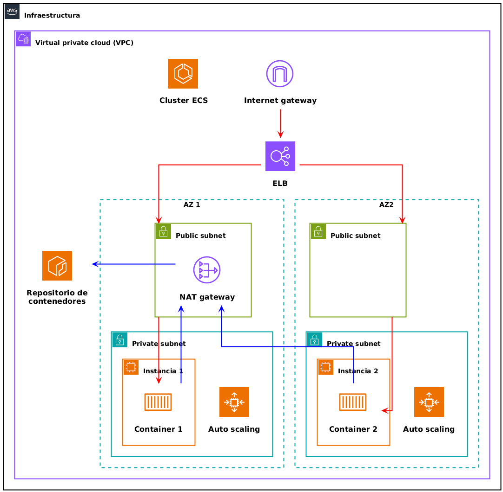
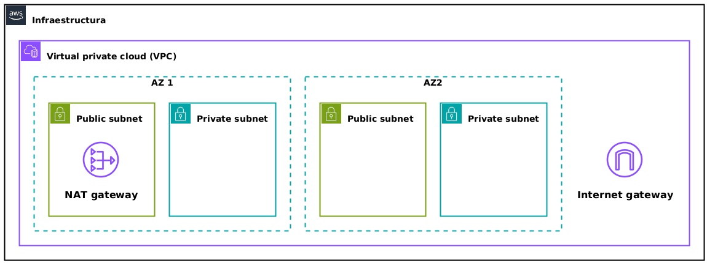
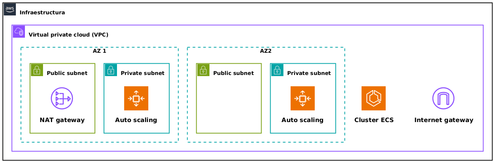

# AWS CloudFormation

En esta práctica os proponemos dos arquitecturas para trabajar con **CloudFormation**, el servicio de Infraestructura como Código nativo de AWS.

La primera de ellas desplegará una infraestructura sencilla, basada en una máquina EC2 y una base de datos desplegada en la misma máquina. La plantilla no solamente creará los recursos, sino que realizará la **conexión** de la aplicación y la base de datos.

La segunda de ellas desplegará una **infraestructura basada en contenedores** usando para ello el servicio **ECS**, *Elastic Container Service*.


## Máquina EC2 + DB con CloudFormation

En este apartado haremos uso de las siguientes características de CloudFormation:

-   Parámetros de entrada
-   *Mappings*
-   *Metadata* y *helper scripts* (`cfn-init`, `cfn-signal` y `cfn-hup`)


### Plantilla

La plantilla puedes consultarla en el fichero [template-cf-metadata.yml](./practica-cf-metadata/template-cf-metadata.yml) de este repositorio.

<details> <summary> Pulsa para ver el contenido del fichero </summary>

```yaml
AWSTemplateFormatVersion: 2010-09-09
Description: >-
  Plantilla para desplegar una pila LAMP en EC2. La máquina EC2 incluye una
  base de datos MySQL, un servidor Apache y el lenguaje PHP.
Parameters:
  DBName:
    Default: MyDatabase
    Description: MySQL database name
    Type: String
    MinLength: '1'
    MaxLength: '64'
    AllowedPattern: '[a-zA-Z][a-zA-Z0-9]*'
    ConstraintDescription: must begin with a letter and contain only alphanumeric characters.
  DBUser:
    NoEcho: 'true'
    Description: Username for MySQL database access
    Type: String
    MinLength: '1'
    MaxLength: '16'
    AllowedPattern: '[a-zA-Z][a-zA-Z0-9]*'
    ConstraintDescription: must begin with a letter and contain only alphanumeric characters.
  DBPassword:
    NoEcho: 'true'
    Description: Password for MySQL database access
    Type: String
    MinLength: '1'
    MaxLength: '41'
    AllowedPattern: '[a-zA-Z0-9]*'
    ConstraintDescription: must contain only alphanumeric characters.
  DBRootPassword:
    NoEcho: 'true'
    Description: Root password for MySQL
    Type: String
    MinLength: '1'
    MaxLength: '41'
    AllowedPattern: '[a-zA-Z0-9]*'
    ConstraintDescription: must contain only alphanumeric characters.
  InstanceType:
    Description: WebServer EC2 instance type
    Type: String
    Default: t2.small
    AllowedValues:
      - t2.nano
      - t2.micro
      - t2.small
    ConstraintDescription: must be a valid EC2 instance type.
  SSHLocation:
    Description: ' The IP address range that can be used to SSH to the EC2 instances'
    Type: String
    MinLength: '9'
    MaxLength: '18'
    Default: 0.0.0.0/0
    AllowedPattern: '(\d{1,3})\.(\d{1,3})\.(\d{1,3})\.(\d{1,3})/(\d{1,2})'
    ConstraintDescription: must be a valid IP CIDR range of the form x.x.x.x/x.
Mappings:
  AWSInstanceType2Arch:
    t2.nano:
      Arch: HVM64
    t2.micro:
      Arch: HVM64
    t2.small:
      Arch: HVM64
  AWSRegionArch2AMI:
    us-east-1:
      HVM64: ami-032930428bf1abbff
      HVMG2: ami-0aeb704d503081ea6
    us-west-1:
      HVM64: ami-088c153f74339f34c
      HVMG2: ami-0a7fc72dc0e51aa77
Resources:
  WebServerInstance:
    Type: AWS::EC2::Instance
    Metadata:
      AWS::CloudFormation::Init:
        configSets:
          InstallAndRun:
            - Install
            - Configure
        Install:
          packages:
            yum:
              mysql: []
              mysql-server: []
              mysql-libs: []
              httpd: []
              php: []
              php-mysql: []
          files:
            /var/www/html/index.php:
              content: !Join 
                - ''
                - - |
                    <html>
                  - |2
                      <head>
                  - |2
                        <title>AWS CloudFormation PHP Sample</title>
                  - |2
                        <meta http-equiv="Content-Type" content="text/html; charset=ISO-8859-1">
                  - |2
                      </head>
                  - |2
                      <body>
                  - |2
                        <h1>Welcome to the AWS CloudFormation PHP Sample</h1>
                  - |2
                        <p/>
                  - |2
                        <?php
                  - |2
                          // Print out the current data and time
                  - |2
                          print "The Current Date and Time is: <br/>";
                  - |2
                          print date("g:i A l, F j Y.");
                  - |2
                        ?>
                  - |2
                        <p/>
                  - |2
                        <?php
                  - |2
                          // Setup a handle for CURL
                  - |2
                          $curl_handle=curl_init();
                  - |2
                          curl_setopt($curl_handle,CURLOPT_CONNECTTIMEOUT,2);
                  - |2
                          curl_setopt($curl_handle,CURLOPT_RETURNTRANSFER,1);
                  - |2
                          // Get the hostname of the intance from the instance metadata
                  - |2
                          curl_setopt($curl_handle,CURLOPT_URL,'http://169.254.169.254/latest/meta-data/public-hostname');
                  - |2
                          $hostname = curl_exec($curl_handle);
                  - |2
                          if (empty($hostname))
                  - |2
                          {
                  - |2
                            print "Sorry, for some reason, we got no hostname back <br />";
                  - |2
                          }
                  - |2
                          else
                  - |2
                          {
                  - |2
                            print "Server = " . $hostname . "<br />";
                  - |2
                          }
                  - |2
                          // Get the instance-id of the intance from the instance metadata
                  - |2
                          curl_setopt($curl_handle,CURLOPT_URL,'http://169.254.169.254/latest/meta-data/instance-id');
                  - |2
                          $instanceid = curl_exec($curl_handle);
                  - |2
                          if (empty($instanceid))
                  - |2
                          {
                  - |2
                            print "Sorry, for some reason, we got no instance id back <br />";
                  - |2
                          }
                  - |2
                          else
                  - |2
                          {
                  - |2
                            print "EC2 instance-id = " . $instanceid . "<br />";
                  - |2
                          }
                  - |2
                          $Database   = "localhost";
                  - '      $DBUser     = "'
                  - !Ref DBUser
                  - |
                    ";
                  - '      $DBPassword = "'
                  - !Ref DBPassword
                  - |
                    ";
                  - |2
                          print "Database = " . $Database . "<br />";
                  - |2
                          $dbconnection = mysql_connect($Database, $DBUser, $DBPassword)
                  - |2
                                          or die("Could not connect: " . mysql_error());
                  - |2
                          print ("Connected to $Database successfully");
                  - |2
                          mysql_close($dbconnection);
                  - |2
                        ?>
                  - |2
                        <h2>PHP Information</h2>
                  - |2
                        <p/>
                  - |2
                        <?php
                  - |2
                          phpinfo();
                  - |2
                        ?>
                  - |2
                      </body>
                  - |
                    </html>
              mode: '000600'
              owner: apache
              group: apache
            /tmp/setup.mysql:
              content: !Sub |
                CREATE DATABASE ${DBName};
                GRANT ALL ON ${DBName}.* TO '${DBUser}'@localhost IDENTIFIED BY '${DBPassword}';
              mode: '000400'
              owner: root
              group: root
            /etc/cfn/cfn-hup.conf:
              content: !Sub |
                [main]
                stack=${AWS::StackId}
                region=${AWS::Region}
                interval=1
              mode: '000400'
              owner: root
              group: root
            /etc/cfn/hooks.d/cfn-auto-reloader.conf:
              content: !Sub |-
                [cfn-auto-reloader-hook]
                triggers=post.update,post.add
                path=Resources.WebServerInstance.Metadata.AWS::CloudFormation::Init
                action=/opt/aws/bin/cfn-init -v --stack ${AWS::StackName} --resource WebServerInstance --configsets InstallAndRun --region ${AWS::Region}
                runas=root
              mode: '000400'
              owner: root
              group: root
          services:
            sysvinit:
              mysqld:
                enabled: 'true'
                ensureRunning: 'true'
              httpd:
                enabled: 'true'
                ensureRunning: 'true'
              # Habilitación del servicio cfh-hup, que escucha cambios en el Metadata
              cfn-hup:
                enabled: 'true'
                ensureRunning: 'true'
                files:
                  - /etc/cfn/cfn-hup.conf
                  - /etc/cfn/hooks.d/cfn-auto-reloader.conf
        Configure:
          commands:
            01_set_mysql_root_password:
              command: !Sub |-
                mysqladmin -u root password '${DBRootPassword}'
              test: !Sub |-
                $(mysql ${DBName} -u root --password='${DBRootPassword}' >/dev/null 2>&1 </dev/null); (( $? != 0 ))
            02_create_database:
              command: !Sub |-
                mysql -u root --password='${DBRootPassword}' < /tmp/setup.mysql
              test: !Sub |-
                $(mysql ${DBName} -u root --password='${DBRootPassword}' >/dev/null 2>&1 </dev/null); (( $? != 0 ))
    Properties:
      IamInstanceProfile: !Ref MyInstanceProfile
      ImageId: !FindInMap 
        - AWSRegionArch2AMI
        - !Ref 'AWS::Region'
        - !FindInMap 
          - AWSInstanceType2Arch
          - !Ref InstanceType
          - Arch
      InstanceType: !Ref InstanceType
      SecurityGroups:
        - !Ref WebServerSecurityGroup
      UserData: !Base64
        Fn::Sub: |-
          #!/bin/bash -xe
          yum update -y aws-cfn-bootstrap
          # Aplicar la configuración definida en la sección Metadata
          /opt/aws/bin/cfn-init -v --stack ${AWS::StackName} --resource WebServerInstance --configsets InstallAndRun --region ${AWS::Region}
          # Enviar señal a CloudFormation con el código de éxito/error del comando cfn-init
          /opt/aws/bin/cfn-signal -e $? --stack ${AWS::StackName} --resource WebServerInstance --region ${AWS::Region}
    CreationPolicy:
      ResourceSignal:
        Timeout: PT5M
  MyInstanceProfile:
    Type: "AWS::IAM::InstanceProfile"
    Properties: 
      Path: "/"
      Roles: 
        - "LabRole"
  WebServerSecurityGroup:
    Type: AWS::EC2::SecurityGroup
    Properties:
      GroupDescription: Enable HTTP access via port 80
      SecurityGroupIngress:
        - IpProtocol: tcp
          FromPort: '80'
          ToPort: '80'
          CidrIp: 0.0.0.0/0
        - IpProtocol: tcp
          FromPort: '22'
          ToPort: '22'
          CidrIp: !Ref SSHLocation
Outputs:
  WebsiteURL:
    Description: URL for newly created LAMP stack
    Value: !Join 
      - ''
      - - 'http://'
        - !GetAtt 
          - WebServerInstance
          - PublicDnsName
```

</details>


### Parámetros

Los parámetros permiten la configuración de los recursos con datos proporcionados por el usuario que despliegue la plantilla. Esta plantilla incluye los siguientes:

-   `DBName` - Nombre de la base de datos
-   `DBUser` - Usuario de la base de datos
-   `DBPassword` - Contraseña del usuario de la base de datos
-   `DBRootPassword` - Contraseña del usuario `root` de la base de datos
-   `InstanceType` - Tipo de instancia. Incluye una **lista de valores válidos**.
-   `SSHLocation` - Rango de IPs desde el que se permitirá la conexión por SSH a la máquina


### Mappings

Son parejas **clave-valor** que permiten seleccionar determinados valores en función de determinadas dependencias o condiciones. En esta tenemos definidos los siguientes:

-   `AWSInstanceType2Arch` - Relaciona el tipo de instancia con una arquitectura
-   `AWSRegionArch2Ami` - Relaciona una región con una AMI

De esta manera, dependiendo de la región donde se lance la plantilla, se elegirá la AMI adecuada: recordemos que las AMIs de los mismos sistemas tienen identificadores distintos en regiones distintas.


### Recursos

Los recursos que se crearán son:

-   **Instancia** - Incluye una sección `Metadata` que analizaremos a continuación, así como las siguientes **propiedades**:
    -   AMI - Especificada en la sección *Mappings* (Amazon Linux)
    -   Tipo - Indicado en el parámetro `InstanceType`
    -   Grupo de seguridad - Referencia al que creará la plantilla como recurso adicional
    -   Perfil de la instancia - Referencia al que creará la plantilla como recurso adicional
    -   `UserData` - Script de inicio que configurará los *helper scripts* de CloudFormation
-   **Perfil de la instancia** - Para asociar un rol de ejecución a la instancia (en el caso de Academy, `LabRole`)
-   **Grupo de seguridad** - Permite la conexión por:
    -   SSH - Desde el rango de IPs indicado en el parámetro `SSHLocation`
    -   HTTP - Desde cualquier IP


### Sección `Metadata` y propiedad `UserData` de la instancia

La sección `Metadata` de la instancia incluye una sección `AWS::CloudFormation::Init:`, que utilizará el script `cfn-init`. Puedes encontrar más detalles sobre esta sección en <https://docs.aws.amazon.com/AWSCloudFormation/latest/UserGuide/aws-resource-init.html>.

Esta sección se combina con un conjunto de comandos, denominados **helper scripts**, que se pueden instalar en la instancia mediante el paquete `aws-cfn-bootstrap`.

Puedes comprobar que se definen un conjunto de `configSets`, que establecen un conjunto de **acciones**, entre las que podemos destacar:

-   `packages` - Para instalar paquetes. En nuestro caso, con `yum`
-   `files` - Para crear ficheros, indicando su contenido, propietario y permisos
-   `services` - Permite habilitar y arrancar servicios
-   `commands` - Para ejecutar comandos

En el caso que nos ocupa, hay dos `configSets`, cuyos objetivos son:

-   Configurar el servidor Apache, junto con PHP y MySQL
-   Crear los usuarios de la base de datos
-   Crear la base de datos
-   Habilitar los servicios de servidor web, base de datos y el **servicio adicional** `cfn-hup` que comentaremos a continuación

La sección `Metadata` define la **configuración deseada de la instancia**. Dicha configuración será aplicada cuando se ejecute el script `cfn-init`, un **helper script** o script auxiliar que podemos ejecutar en nuestra instancia.

En nuestro caso, ejecutaremos dicho script en **dos situaciones**:

1.  **Al crear la instancia**, mediante el script presente en la propiedad `UserData`.
    
    ```yaml
    UserData: !Base64
      Fn::Sub: |-
        #!/bin/bash -xe
        yum update -y aws-cfn-bootstrap
        # Aplicar la configuración definida en la sección Metadata
        /opt/aws/bin/cfn-init -v --stack ${AWS::StackName} --resource WebServerInstance --configsets InstallAndRun --region ${AWS::Region}
        # Enviar señal a CloudFormation con el código de éxito/error del comando cfn-init
        /opt/aws/bin/cfn-signal -e $? --stack ${AWS::StackName} --resource WebServerInstance --region ${AWS::Region}
    ```
    
    Como puede verse, en primer lugar se instalará el paquete `aws-cfn-bootstrap`, que instala los helper scripts de CloudFormation. A continuación, se ejecuta `cfn-init`, para **aplicar la configuración** definida en la sección `Metadata`. Por último, se ejecutará `cfn-signal`, que enviará el resultado de la ejecución de la instrucción anterior para que CloudFormation valide si la configuración se ha realizado con éxito o no:
    
    ```yaml
    CreationPolicy:
      ResourceSignal:
        Timeout: PT5M
    ```
    
    De esta manera, para que CloudFormation considere el recurso como **creado con éxito**, debe **recibir una señal en un plazo de 15 minutos** (`PT5M`). Por tanto, el comando `cfn-init` no debe emitir ningún error (debe completarse con éxito y aplicar toda la configuración definida en el `Metadata`) para que `cfn-signal` emita dicha señal de éxito. Tienes más información sobre `CreationPolicy` aquí: <https://docs.aws.amazon.com/es_es/AWSCloudFormation/latest/UserGuide/aws-attribute-creationpolicy.html>
2.  **Al actualizarse la sección Metadata** como resultado de realizar una **actualización del stack** de CloudFormation enviando una **actualización de la plantilla**. Ello se consigue **instalando el servicio** `cfn-hup`, que se encarga de **detectar cambios en la sección Metadata** del stack al que pertenece la máquina EC2. Efectivamente, mediante `cfn-init`, en su primera ejecución lanzada desde el `UserData`, se instalan los siguientes **ficheros**:
    
    ```yaml
    /etc/cfn/cfn-hup.conf:
      content: !Sub |
        [main]
        stack=${AWS::StackId}
        region=${AWS::Region}
        interval=1
      mode: '000400'
      owner: root
      group: root
    /etc/cfn/hooks.d/cfn-auto-reloader.conf:
      content: !Sub |-
        [cfn-auto-reloader-hook]
        triggers=post.update,post.add
        path=Resources.WebServerInstance.Metadata.AWS::CloudFormation::Init
        action=/opt/aws/bin/cfn-init -v --stack ${AWS::StackName} --resource WebServerInstance --configsets InstallAndRun --region ${AWS::Region}
        runas=root
      mode: '000400'
      owner: root
      group: root
    ```
    
    Estos ficheros crean una configuración para **relanzar el comando** `cfn-init` cuando el servicio `cfn-hup` detecta un cambio en la sección `Metadata`. Observa que hemos añadido el parámetro `interval=1` para que `cfn-hup` realice las comprobaciones cada minuto y podamos comprobar el funcionamiento de manera rápida (el tiempo por defecto es de 15 minutos). Por último, puedes ver cómo se habilita el servicio aquí:
    
    ```yaml
    services:
      sysvinit:
        mysqld:
          enabled: 'true'
          ensureRunning: 'true'
        httpd:
          enabled: 'true'
          ensureRunning: 'true'
        # Habilitación del servicio cfh-hup, que escucha cambios en el Metadata
        cfn-hup:
          enabled: 'true'
          ensureRunning: 'true'
          files:
            - /etc/cfn/cfn-hup.conf
            - /etc/cfn/hooks.d/cfn-auto-reloader.conf
    ```

Tienes más detalles sobre dichos scripts en <https://docs.aws.amazon.com/AWSCloudFormation/latest/UserGuide/cfn-helper-scripts-reference.html>


### Tareas propuestas

-   Desplegar una actualización del stack **cambiando el tipo de instancia**. ¿Qué ocurre? ¿Se reemplaza o se apaga y se vuelve a conectar? (Básico)
-   Realizar una modificación de la sección `Metadata` de la plantilla, creando un **archivo nuevo con tu nombre y apellidos** y comprobar que se crea automáticamente en la instancia cuando se sube de nuevo para actualizar el stack. (Básico)
-   Modificar la plantilla para añadir una **base de datos en RDS** y conectarla mediante **helper scripts** a la máquina EC2. (Avanzado)
-   Sobre esta última opción, añadir una configuración a la plantilla para realizar una copia de seguridad de la base de datos antes de eliminarse (Avanzado).


## Práctica ECS

En esta práctica realizaremos un despliegue de un **clúster ECS** (Elastic Container Service) para desplegar aplicaciones basadas en **contenedores**.

Para ello, utilizaremos **CloudFormation**, el servicio de Infraestructura como Código nativo de AWS.

Cuando desplegamos aplicaciones en **contenedores** es necesario tener en cuenta **dos ámbitos** de gestión:

1.  Por un lado, la **infraestructura** que soportará los contenedores. En el caso de AWS, dicha infraestructura estará formada por **máquinas virtuales**, que serán los **nodos** del sistema de contenedores. Dichos nodos pueden ser gestionados por **dos proveedores**:
    -   **EC2**, normalmente a través de algún **grupo de autoescalado** que ponga en marcha las máquinas virtuales necesarias para acomodar los contenedores que se deseen desplegar. En función de las necesidades de los contenedores (fundamentalmente CPU y RAM), el grupo de autoescalado creará más o menos máquinas en función de unos límites establecidos.
    -   **Fargate**, un servicio de AWS que abstrae la creación de infraestructura, creando **máquinas virtuales completamente gestionadas**, al margen del servicio EC2, para acomodar los contenedores que se deseen desplegar.
2.  En segundo lugar, los **contenedores** que se deseen desplegar. Estos contenedores, en el sistema ECS que vamos a utilizar, se despliegan en **tareas** (*tasks*), que pueden ejecutarse de manera programada, a demanda o como **servicio**. Mediante la creación de un **servicio** es posible desplegar un conjunto de tareas que se ejecutarán de manera continua, pudiendo además desplegarse en modo **réplica**, de tal manera que las peticiones puedan ser procesadas por un **conjunto de tareas**. En este último caso se suele utilizar algún sistema adicional (como un **balanceador de carga**) para enviar el tráfico que vaya dirigido al servicio y **distribuirlo entre las tareas réplica** desplegadas. Así, podremos realizar un **escalado horizontal** de contenedores.

El esquema final de la aplicación será el siguiente:



Crearemos un **servicio** en ECS basado en un **balanceador de carga**. Dicho balanceador actuará como **punto de entrada para la aplicación** y redirigirá el tráfico a la **aplicación web** desplegada en **contenedores**.

Con el objetivo de proporcionar **alta disponibilidad**, tendremos la posibilidad de desplegar **múltiples copias de la aplicación** en modo réplica, cada una de ellas desplegada en un contenedor definido mediante una tarea. Así, si un contenedor se corrompe, el balanceador podrá seguir enviando el tráfico a los contenedores activos mientras que el servicio **crea nuevos contenedores** que sustituyan al contenedor caído.

El código de la infraestructura se incluye en los ficheros del repositorio. En ellos se pueden ver ejemplos de algunas de las características de CloudFormation, como:

-   Parámetros
-   Recursos
-   Referencias a recursos
-   Dependencias
-   Plantillas anidadas

A continuación se explica brevemente el contenido y funcionamiento de los diferentes ficheros que contienen las plantillas de la aplicación a desplegar, junto con los recursos que crearán.


### Plantilla `toplevel.yml`

Recursos que crea esta plantilla:

-   Stack `MyNetworkStack` - Desplegará los recursos definidos en la plantilla guardada en el fichero `network.yml`: **infraestructura de red** (VPC, subredes, etc.)
-   Stack `MyClusterStack` - Desplegará los recursos definidos en la plantilla guardada en el fichero `templateecs.yml`: **clúster ECS** y **proveedor de capacidad**, que utilizará un **grupo de autoescalado EC2**.
-   Stack `MyServiceStack` - Desplegará los recursos definidos en la plantilla guardada en el fichero `templateservice.yml`: **servicio** que estará formado por un **conjunto de tareas** en modo **réplica** accesible a través de un balanceador de carga. Mediante este servicio, múltiples contenedores procesarán las peticiones que reciba la aplicación.

Parámetros:

-   `WebServiceName` - Nombre del servicio


### Plantilla `network.yml`

Recursos que crea esta plantilla:

-   VPC
-   2 subredes privadas
-   2 subredes públicas
-   Internet Gateway
-   NAT Gateway con Elastic IP - Es necesario para que las instancias o nodos del cluster ECS puedan acceder a Internet para:
    -   Registrarse como nodos del cluster ECS
    -   Descargar las imágenes de los contenedores que tengan que desplegar
-   Tablas de enrutamiento para subredes privadas con las correspondientes asociaciones
-   Tablas de enrutamiento para subredes públicas con las correspondientes asociaciones

Parámetros: ninguno.




### Plantilla `templateecs.yml`

Recursos que crea esta plantilla:

-   Cluster ECS
-   Launch template - Define la plantilla de lanzamiento que se utilizará para crear las instancias del cluster. Entre otras cosas, define la AMI a utilizar, el tamaño y tipo de la instancia, el perfil IAM de la instancia, grupo de seguridad y **script** de inicio (`UserData`) para **registrar las instancias como nodos del cluster ECS**.
-   Grupo de autoescalado - Lanzará instancias automáticamente para acomodar los contenedores definidos en las tareas. Utilizará para ellos las subredes indicadas, en nuestro caso, las subredes privadas.
-   Perfil IAM de las instancias - Rol asociado a la instancia que debe tener **permisos para registrarse en el cluster ECS y acceder a los repositorios de imágenes de contenedores** para poder descargar los contenedores que le indique el cluster ECS. En nuestro caso, utilizaremos el rol `LabRole` de **AWS Academy** (recuerda que no podemos crear roles en Academy).
-   Capacity provider con escalado automático - Un *capacity provider* en ECS define un proveedor de capacidad, es decir, un **mecanismo para aprovisionar instancias** donde poder ejecutar los contenedores. En este caso crearemos uno que hará uso de un **grupo de autoescalado**, creado en este mismo stack. El grupo de autoescalado tiene un mínimo de 0 y un valor deseado inicial de 0. Así, si no hay tareas o servicios de contenedores para desplegar, no se creará ninguna máquina EC2; si es necesario desplegar contenedores, se lanzarán las máquinas necesarias manteniendo el máximo indicado para no incurrir en costes adicionales. Se incluye también la **asociación** entre el cluster y el proveedor de capacidad.
-   Grupo de seguridad para los hosts - Define un grupo de seguridad vacío para las instancias del cluster ECS. Al definir el servicio se incluirán las reglas para el servicio en concreto.

Parámetros:

-   `InstanceType` - Tamaño y tipo de las instancias a utilizar
-   `DesiredCapacity` - Número de instancias que se lanzarán inicialmente en el cluster
-   `MaxSize` - Número máximo de instancias que lanzará el grupo de autoescalado para acomodar tareas de contenedores
-   `ECSAMI` - `AMI` que se utilizará para crear las instancias
-   `VpcId` - VPC donde se desplegarán las instancias del grupo de autoescalado. Este valor se cogerá de la salida del stack `Network`, para utilizar la VPC creada.
-   `SubnetIds` - Subredes donde se desplegarán las instancias del grupo de autoescalado. Este valor se cogerá de la salida del stack `Network`, para utilizar las subredes creadas.




### Plantilla `templateservice.yml`

-   *Task definition* - Define el tipo de tarea que ejecutará el servicio. Algunos de sus parámetros son:
    -   Cantidad de CPU y memoria alojada para dicha tarea
    -   Configuración de red
    -   Tipo de nodo de computación (EC2 en nuestro caso)
    -   Rol de ejecución. Indica qué acciones dentro de AWS puede ejecutar el código de dicho contenedor. En nuestro caso será el de Academy (`LabRole`)
    -   Datos del **contenedor**, incluyendo la ruta de la **imagen** y el **puerto** de escucha
-   Servicio - Define un **punto de entrada** para acceder a la aplicación desplegada en las tareas en forma de contenedores. Hace referencia a:
    -   Definición de tarea
    -   Número de copias de la tarea que se deben desplegar
    -   Balanceador de carga que actuará como punto de entrada del tráfico
    -   Proveedor de capacidad para elegir qué instancias (nodos) se deben utilizar para desplegar las tareas
-   Grupo de seguridad del servicio - Permite tráfico entrante al puerto de escucha del servicio, que será el puerto 80.
-   Balanceador de carga (ELB) - Desplegado en subredes públicas, conectado a Internet
-   ELB security group - Permite el tráfico de entrada al balanceador en el puerto 80
-   Grupo de destino del ELB - Se utilizará para asociar las IPS internas de las tareas desplegadas como destinos de tráfico del balanceador de carga. Así, **el tráfico que llegue al balanceador será repartido entre las IPs de las tareas**, que serán los **contenedores** desplegados. Este reparto se configura en el *Listener*, definido a continuación.
-   *Listener* del ELB - Realiza la conexión entre el ELB con el TargetGroup. Escucha en el puerto 80.

Parámetros:

-   `VpcId` - VPC donde se lanzará el servicio. Este valor se cogerá de la salida del stack `Network`, para utilizar la VPC creada.
-   `PublicSubnetIds` - El servicio utilizará un balanceador de carga. Este parámetro se utiliza para indicar las subredes públicas a las que se conectará el balanceador.Este valor se cogerá de la salida del stack `Network`, para utilizar las subredes creadas.
-   `PrivateSubnetIds` - Subredes donde se desplegarán las tareas de contenedores creadas por el servicio. Estarán en las subredes privadas y será el balanceador el que las conecte a Internet. Este valor se cogerá de la salida del stack `Network`, para utilizar las subredes creadas.
-   `ClusterName` - Nombre del cluster ECS. Se tomará de la salida del stack `ecs`.
-   `CapacityProvider` - Nombre del proveedor de capacidad disponible para el cluster ECS. Se tomará de la salida del stack `ecs`.
-   `ServiceName` - Nombre del servicio.
-   `ImageUrl` - Imagen del contenedor que se va a desplegar en las tareas que cree el servicio.
-   `ContainerCpu` - Cantidad de CPU a asignar a cada tarea. 1024 corresponde a 1 CPU.
-   `ContainerMemory` - Cantidad de RAM en MB a asignar a cada tarea.
-   `ContainerPort` - Puerto en el que escucharán los contenedores.
-   `DesiredCount` - Número de tareas simultáneas que debe ejecutar el servicio. Las tareas se ejecutarán en paralelo y el tráfico les será enviado por el balanceador de carga.


### Instrucciones de despliegue

La infraestructura que vamos a crear está formada por un fichero que hace referencia a otros ficheros de plantilla (plantillas anidadas). Mediante CloudFormation solo se puede desplegar un fichero de plantilla, por lo que es necesario hacer un proceso previo, denominado **empaquetado**, (*package*), que consiste en lo siguiente:

-   Lanzar el comando `aws cloudformation package` indicando el nombre del fichero de la **plantilla principal**, indicando un **bucket S3** que exista en la cuenta.
-   Dicho comando realizará varias acciones:
    1.  Procesará las rutas locales que hagan referencia a otros ficheros de plantilla
    2.  Subirá dichas plantillas al bucket de S3
    3.  Creará una nueva plantilla **cambiando** las referencias a los **archivos locales** por referencias a las plantillas **guardadas en S3**.
-   Al final, acabaremos con un **nuevo fichero de plantilla principal** con las referencias a las plantillas "hijas" subidas a S3. Este archivo será el que despleguemos con CloudFormation.

El procedimiento a seguir es el siguiente:

1.  Crear un bucket en S3 en nuestra cuenta
2.  Realizar el proceso de empaquetado:
    
    ```bash
    aws cloudformation package --s3-bucket BUCKET_NAME --template toplevel.yml \
      --output-template-file packaged.yml --output yaml
    # Hay que cambiar BUCKET_NAME por el nombre del bucket que hayamos creado
    ```
3.  Desplegar la plantilla procesada:
    
    ```bash
    aws cloudformation deploy --template-file packaged.yml --stack-name aplicacionecs \
      --region us-east-1 --capabilities CAPABILITY_NAMED_IAM
    # El fichero packaged.yml es el que crea el paso anterior de empaquetado
    # Es posible cambiar el nombre del stack, que en este caso es "aplicacionecs"
    ```

> [!NOTE]
> Aspectos a tener en cuenta:
> 
> -   Se asume el despliegue desde Cloud9 o una instancia EC2 configurada con el rol `LabRole`. En caso de utilizar un ordenador personal, será necesario instalar las credenciales en el archivo `~/.aws/credentials`.
> -   Opción `--capabilities CAPABILITY_NAMED_IAM` para indicar que CloudFormation va a utilizar recursos de IAM existentes, en concreto el `LabRole` de AWS Academy (en caso contrario sería necesario incorporar `CAPABILITY_IAM`, si se necesitara crear recursos de IAM). Más información en <https://docs.aws.amazon.com/AWSCloudFormation/latest/APIReference/API_CreateStack.html>


### Tareas propuestas

-   Realizar cambios en el número de instancias del proveedor de capacidad para que siempre haya como mínimo una instancia en ejecución. (Básico)
-   Cambiar el número de tareas que ejecuta el servicio, haciendo que se ejecuten **4** en lugar de 2. (Básico)
-   Desplegar un contenedor **diferente del propuesto** que implemente una aplicación web diferente. Si no se dispone de ninguna aplicación, se ofrece un fichero [Dockerfile](./ecs/dockertest/Dockerfile) con una aplicación web básica de ejemplo. Se propone:
    
    -   Crear un repositorio en el servicio **ECR**, *Elastic Container Registry*, el servicio de AWS para almacenar imágenes de contenedores.
    -   Conectarse al repositorio
    -   Crear una nueva imagen de contenedor. Puede utilizarse una propia o utilizar el fichero `Dockerfile` incluido en el repositorio.
    -   Subir la imagen al repositorio.
    -   Actualizar el servicio para que se despliegue la imagen creada.
    
    Las instrucciones para crear una imagen se pueden obtener al crear un repositorio en ECR. A continuación se muestra un ejemplo para un repositorio ficticio:
    
    ```bash
    # Cerrar sesión en ECR
    docker logout public.ecr.aws
    
    # Iniciar sesión en ECR
    aws ecr get-login-password --region us-east-1 | docker login --username AWS --password-stdin XXXXXXXXXXX.dkr.ecr.us-east-1.amazonaws.com
    
    # Construir imagen
    docker build -t testcontainer1 .
    
    # Añadir tag
    docker tag testcontainer1:latest XXXXXXXXXXX.dkr.ecr.us-east-1.amazonaws.com/testcontainer1:latest
    
    # Subir imagen creada
    docker push XXXXXXXXXXX.dkr.ecr.us-east-1.amazonaws.com/testcontainer1:latest
    ```
-   Modificar la infraestructura para que se despliegue mediante **Fargate** en lugar de EC2. (Avanzado). En este caso, puedes tomar la plantilla de servicio como ejemplo para crear una que utilice un servicio con propiedad `LaunchType` de tipo `FARGATE` en lugar de `CapacityProviderStrategy`. Puedes consultar más detalles en la documentación: <https://docs.aws.amazon.com/AWSCloudFormation/latest/UserGuide/aws-resource-ecs-service.html#cfn-ecs-service-launchtype>. Quedaría una definición parecida a esta, en caso de que quieras desplegar las tareas de manera **sencilla sin balanceador de carga** en **subredes públicas** y con **IP pública**.
    
    ```yaml
    # Nuevo servicio con Fargate
    Service2:
      Type: AWS::ECS::Service
      Properties:
        ServiceName: !Ref ServiceName
        Cluster: !Ref ClusterName
        # Tipo de lanzamiento: FARGATE
        LaunchType: FARGATE
        NetworkConfiguration:
          AwsvpcConfiguration:
            # Asignación de IPs públicas
            AssignPublicIp: ENABLED
            SecurityGroups:
              - !Ref ServiceSecurityGroup
            # Despliegue en subredes públicas
            Subnets: !Ref PublicSubnetIds
        DesiredCount: !Ref DesiredCount
        TaskDefinition: !Ref TaskDefinition2
    ```
    
    También habría que cambiar la **definición de tarea** para añadir `FARGATE` en la propiedad `RequiresCompatibilities`:
    
    ```yaml
    # Nueva tarea con Fargate
    TaskDefinition2:
      Type: 'AWS::ECS::TaskDefinition'
      Properties:
        Family: !Ref ServiceName
        Cpu: !Ref ContainerCpu
        Memory: !Ref ContainerMemory
        NetworkMode: awsvpc
        RequiresCompatibilities:
          - EC2
          # Añadimos FARGATE
          - FARGATE
        ExecutionRoleArn: !Sub arn:aws:iam::${AWS::AccountId}:role/LabRole
        ContainerDefinitions:
          - Name: !Ref ServiceName
            Cpu: !Ref ContainerCpu
            Memory: !Ref ContainerMemory
            Image: !Ref ImageUrl
            PortMappings:
              - ContainerPort: !Ref ContainerPort
                HostPort: !Ref ContainerPort
            LogConfiguration:
              LogDriver: awslogs
              Options:
                mode: non-blocking
                max-buffer-size: 25m
                awslogs-group: !Ref LogGroup
                awslogs-region: !Ref AWS::Region
                awslogs-stream-prefix: !Ref ServiceName
    
    ```
    
> [!WARNING]
> 
> Si vas a desplegar este nuevo servicio, hazlo mediante un despliegue independiente, introduciendo los parámetros al crear el stack. Si lo haces mediante plantilla anidada del stack completo es posible que te encuentres con algunos problemas de actualización. Si es el caso, elimina el servicio existente y entonces trata de desplegarlo todo de nuevo.
